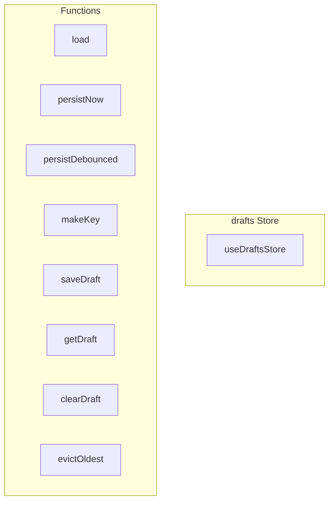

# drafts Store

**File:** `src/stores/drafts.ts`

## Overview




## Exports

- **useDraftsStore** - const export

## Functions

### `load()`

No description available.

**Parameters:**
None

**Returns:** `void`

```typescript
function load()
```

### `persistNow()`

No description available.

**Parameters:**
None

**Returns:** `void`

```typescript
function persistNow()
```

### `persistDebounced()`

No description available.

**Parameters:**
None

**Returns:** `void`

```typescript
function persistDebounced()
```

### `makeKey(type: 'channel' | 'conversation' | 'thread', id: string)`

No description available.

**Parameters:**
- `type: 'channel' | 'conversation' | 'thread'`
- `id: string`

**Returns:** `string`

```typescript
function makeKey(type: 'channel' | 'conversation' | 'thread', id: string): string
```

### `saveDraft(key: string, content: string)`

No description available.

**Parameters:**
- `key: string`
- `content: string`

**Returns:** `void`

```typescript
function saveDraft(key: string, content: string)
```

### `getDraft(key: string)`

No description available.

**Parameters:**
- `key: string`

**Returns:** `string`

```typescript
function getDraft(key: string): string
```

### `clearDraft(key: string)`

No description available.

**Parameters:**
- `key: string`

**Returns:** `void`

```typescript
function clearDraft(key: string)
```

### `evictOldest()`

No description available.

**Parameters:**
None

**Returns:** `void`

```typescript
function evictOldest()
```


## Constants

### STORAGE_KEY

No description available.

```typescript
const STORAGE_KEY = 'message-drafts'
```

### SAVE_DEBOUNCE_MS

No description available.

```typescript
const SAVE_DEBOUNCE_MS = 500
```

### MAX_DRAFTS

No description available.

```typescript
const MAX_DRAFTS = 100
```


## Source Code Insights

**File Size:** 1800 characters
**Lines of Code:** 74
**Imports:** 3

## Usage Example

```typescript
import { useDraftsStore } from '@/stores/drafts'

// Example usage
load()
```

---

*This documentation was automatically generated from the source code.*