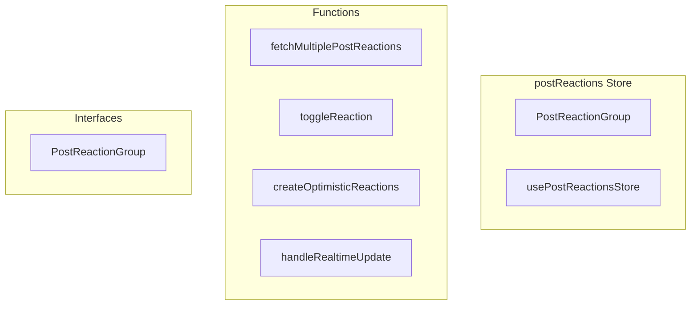

# postReactions Store

**File:** `src/stores/postReactions.ts`

## Overview




## Exports

- **PostReactionGroup** - interface export
- **usePostReactionsStore** - const export

## Functions

### `fetchMultiplePostReactions(postIds: string[], force = false)`

No description available.

**Parameters:**
- `postIds: string[]`
- `force = false`

**Returns:** `Promise&lt;void&gt;`

```typescript
/**
 * Post Reactions Store - Professional Architecture
 * 
 * Follows the same pattern as useReactions.ts for chat messages
 * Key principles:
 * 1. Batch loading to prevent N+1 queries
 * 2. Optimistic updates for instant UI feedback using REAL user data
 * 3. Limited user data (5 users max) for scalability
 * 4. Centralized state management
 * 5. Real-time subscription support
 * 
 * IMPROVEMENT: Follows exact same pattern as useReactions.ts for chat messages
 * - Minimal optimistic state (no user data in optimistic updates)
 * - Real user data comes from actual fetch after database update
 * - Prevents tooltip flashing by keeping user_reactions arrays stable
 */
export const usePostReactionsStore = defineStore('postReactions', () => {
  // State - Simple and clean
  const reactionsByPost = ref(new Map<string, PostReactionGroup[]>())
  const lastFetched = ref(new Map<string, number>())
  const isLoading = ref(new Set<string>())
  
  // Optimistic state - separate from computed properties
  const optimisticReactions = ref(new Map<string, PostReactionGroup[]>())
  const pendingToggleRequests = ref(new Set<string>())

  // Simple getters - no merging, no loops
  const getPostReactions = computed(() => (postId: string): PostReactionGroup[] => {
    if (!postId) return []
    
    // Check if we have optimistic state for this post
    const optimistic = optimisticReactions.value.get(postId)
    if (optimistic) {
      return optimistic
    }
    
    // Otherwise show real data
    return reactionsByPost.value.get(postId) || []
  })

  const hasUserReacted = computed(() => (postId: string, emojiId: string | null, customContent: string | null): boolean => {
    const reactions = getPostReactions.value(postId)
    const reaction = reactions.find(r => 
      (emojiId && r.emoji_id === emojiId) || 
      (customContent && r.custom_emoji_content === customContent)
    )
    return reaction?.current_user_reacted || false
  })

  const isLoadingReactions = computed(() => (postId: string): boolean => {
    return isLoading.value.has(postId)
  })

  // Actions
  async function fetchPostReactions(postId: string, force = false): Promise<void> {
    if (!postId) return

    const now = Date.now()
    const lastFetch = lastFetched.value.get(postId) || 0
    
    // Skip if recently fetched (unless forced)
    if (!force && now - lastFetch < 30000) return
    
    if (isLoading.value.has(postId)) return

    try {
      isLoading.value.add(postId)
      
      const { data, error } = await supabase.rpc('get_post_emoji_reactions', {
        p_post_id: postId,
        p_user_limit: 5 // Professional limit for scalability
      })

      if (error) {
        debug.error('❌ Failed to fetch post reactions:', error)
        return
      }

      reactionsByPost.value.set(postId, data || [])
      lastFetched.value.set(postId, now)
      
      debug.log(`✅ Fetched ${data?.length || 0} reaction groups for post ${postId}`)
    } catch (error) {
      debug.error('❌ Error fetching post reactions:', error)
    } finally {
      isLoading.value.delete(postId)
    }
  }

  /**
   * CRITICAL: Batch fetch reactions for multiple posts to avoid N+1 queries
   * This is essential for performance when loading timelines
   */
  async function fetchMultiplePostReactions(postIds: string[], force = false): Promise<void>
```

### `toggleReaction(postId: string, emoji: { id?: string; native?: string; name?: string; url?: string }, userId: string)`

No description available.

**Parameters:**
- `postId: string`
- `emoji: { id?: string; native?: string; name?: string; url?: string }`
- `userId: string`

**Returns:** `Promise&lt;`

```typescript
/**
   * Simple reaction toggle with instant UI feedback
   */
  async function toggleReaction(
    postId: string, 
    emoji: { id?: string; native?: string; name?: string; url?: string },
    userId: string
  ): Promise<
```

### `createOptimisticReactions(baseReactions: PostReactionGroup[], emoji: { id?: string; native?: string; name?: string }, userId: string, operation: 'add' | 'remove')`

No description available.

**Parameters:**
- `baseReactions: PostReactionGroup[]`
- `emoji: { id?: string; native?: string; name?: string }`
- `userId: string`
- `operation: 'add' | 'remove'`

**Returns:** `PostReactionGroup[]`

```typescript
/**
   * Create optimistic reaction state with real user data
   */
  function createOptimisticReactions(
    baseReactions: PostReactionGroup[], 
    emoji: { id?: string; native?: string; name?: string },
    userId: string, 
    operation: 'add' | 'remove'
  ): PostReactionGroup[]
```

### `handleRealtimeUpdate(payload: any)`

No description available.

**Parameters:**
- `payload: any`

**Returns:** `Promise&lt;void&gt;`

```typescript
/**
   * Real-time update handler - smart handling for optimistic state
   */
  async function handleRealtimeUpdate(payload: any): Promise<void>
```


## Interfaces

### PostReactionGroup

No description available.

```typescript
interface PostReactionGroup {

  emoji_id: string | null
  emoji_name: string | null
  emoji_url: string | null
  custom_emoji_content: string | null
  reaction_count: number
  user_reactions: Array<{
    user_id: string
    username: string
    display_name: string
    avatar_url: string
    created_at: string
  }>
  current_user_reacted: boolean

}
```


## Source Code Insights

**File Size:** 14309 characters
**Lines of Code:** 408
**Imports:** 4

## Usage Example

```typescript
import { PostReactionGroup, usePostReactionsStore } from '@/stores/postReactions'

// Example usage
fetchMultiplePostReactions()
```

---

*This documentation was automatically generated from the source code.*