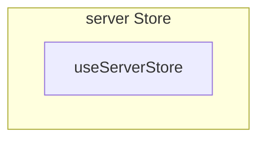

# server Store

**File:** `src/stores/server.ts`

## Overview




## Exports

- **useServerStore** - const export


## Source Code Insights

**File Size:** 6020 characters
**Lines of Code:** 178
**Imports:** 5

## Usage Example

```typescript
import { useServerStore } from '@/stores/server'

// Example usage
// Use the exported functionality
```

---

*This documentation was automatically generated from the source code.*