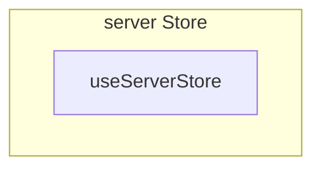

# server Store

**File:** `src/stores/server.ts`

## Overview


```mermaid
graph TB
    subgraph "server Store"
        USESERVERSTORE[useServerStore]
    end
    
    
    
    
```

## Exports

- **useServerStore** - No description


## Source Code Insights

**File Size:** 4908 characters
**Lines of Code:** 155
**Imports:** 3

## Usage Example

```typescript
import { useServerStore } from '@/stores/server.ts'

// Example usage
// Use the exported functionality
```

---

*This documentation was automatically generated from the source code.*