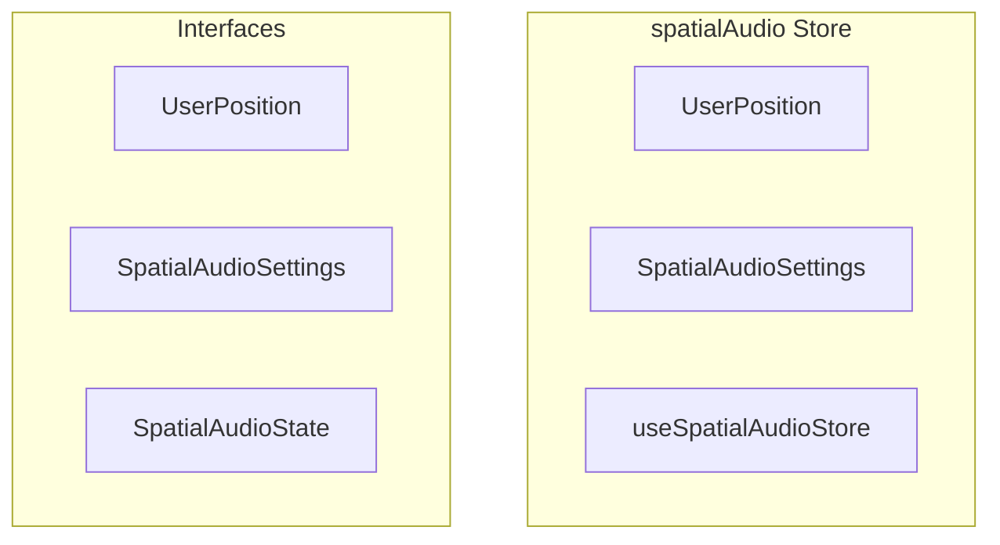

# spatialAudio Store

**File:** `src/stores/spatialAudio.ts`

## Overview




## Exports

- **UserPosition** - interface export
- **SpatialAudioSettings** - interface export
- **useSpatialAudioStore** - const export


## Interfaces

### UserPosition

No description available.

```typescript
interface UserPosition {

  userId: string;
  x: number;
  y: number;
  z?: number; // For future 3D support

}
```

### SpatialAudioSettings

No description available.

```typescript
interface SpatialAudioSettings {

  enabled: boolean;
  maxDistance: number;
  rolloffFactor: number;
  panningModel: 'equalpower' | 'HRTF';
  distanceModel: 'linear' | 'inverse' | 'exponential';
  enableReverb: boolean;
  roomSize: number;
  binauralIntensity: number; // 0-1, controls how dramatic the binaural effect is

}
```

### SpatialAudioState

No description available.

```typescript
interface SpatialAudioState {

  // Settings
  settings: SpatialAudioSettings;
  
  // UI State
  isPanelVisible: boolean;
  panelSize: { width: number; height: number };
  gridScale: number;
  
  // User positions
  userPositions: Map<string, UserPosition>;
  
  // Dragging state
  isDragging: boolean;
  draggedUserId: string | null;
  dragOffset: { x: number; y: number };

}
```


## Source Code Insights

**File Size:** 12058 characters
**Lines of Code:** 360
**Imports:** 2

## Usage Example

```typescript
import { UserPosition, SpatialAudioSettings, useSpatialAudioStore } from '@/stores/spatialAudio'

// Example usage
// Use the exported functionality
```

---

*This documentation was automatically generated from the source code.*