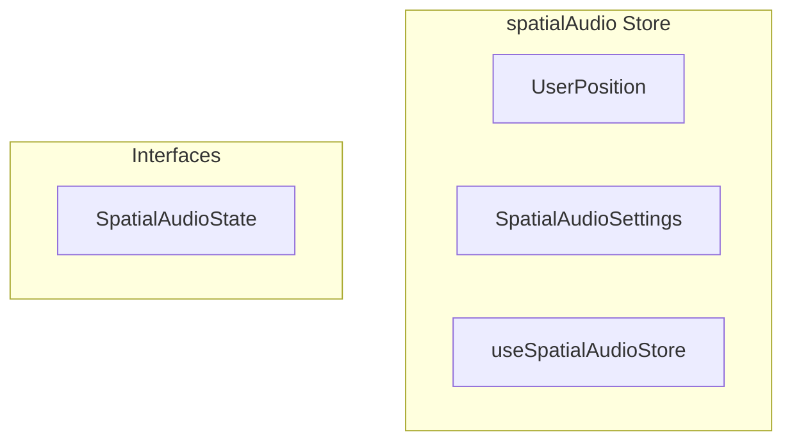

# spatialAudio Store

**File:** `src/stores/spatialAudio.ts`

## Overview


```mermaid
graph TB
    subgraph "spatialAudio Store"
        USERPOSITION[UserPosition]
        SPATIALAUDIOSETTINGS[SpatialAudioSettings]
        USESPATIALAUDIOSTORE[useSpatialAudioStore]
    end
    
    
    
    subgraph "Interfaces"
        USERPOSITION[UserPosition]
        SPATIALAUDIOSETTINGS[SpatialAudioSettings]
        SPATIALAUDIOSTATE[SpatialAudioState]
    end
```

## Exports

- **UserPosition** - No description
- **SpatialAudioSettings** - No description
- **useSpatialAudioStore** - No description


## Interfaces

### UserPosition

No description available.

```typescript
export interface UserPosition {
  userId: string;
  x: number;
  y: number;
  z?: number; // For future 3D support
}
```

### SpatialAudioSettings

No description available.

```typescript
export interface SpatialAudioSettings {
  enabled: boolean;
  maxDistance: number;
  rolloffFactor: number;
  panningModel: 'equalpower' | 'HRTF';
  distanceModel: 'linear' | 'inverse' | 'exponential';
  enableReverb: boolean;
  roomSize: number;
}
```

### SpatialAudioState

No description available.

```typescript
interface SpatialAudioState {
  // Settings
  settings: SpatialAudioSettings;
  
  // UI State
  isPanelVisible: boolean;
  panelSize: { width: number; height: number }
```


## Source Code Insights

**File Size:** 10765 characters
**Lines of Code:** 335
**Imports:** 1

## Usage Example

```typescript
import { UserPosition, SpatialAudioSettings, useSpatialAudioStore } from '@/stores/spatialAudio.ts'

// Example usage
// Use the exported functionality
```

---

*This documentation was automatically generated from the source code.*