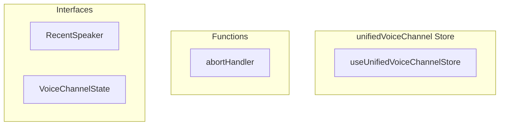

# unifiedVoiceChannel Store

**File:** `src/stores/unifiedVoiceChannel.ts`

## Overview




## Exports

- **useUnifiedVoiceChannelStore** - const export

## Functions

### `abortHandler()`

No description available.

**Parameters:**
None

**Returns:** `Unknown`

```typescript
const abortHandler = () =>
```


## Interfaces

### RecentSpeaker

No description available.

```typescript
interface RecentSpeaker {

  userId: string;
  lastSpokeAt: number;

}
```

### VoiceChannelState

No description available.

```typescript
interface VoiceChannelState {

  // Connection info
  currentChannelId: string | null;
  currentServerId: string | null;
  currentChannelName: string | null;
  isConnected: boolean;
  sessionStartTime: Date | null; // Track when the user joined the channel
  callStartTime: Date | null; // Track when the call started (first user joined)
  
  // Federation state
  isFederatedChannel: boolean;
  federatedTokenSubscription: RealtimeChannel | null;
  pendingFederatedJoin: {
    channelId: string;
    serverId: string;
    timeout
  // ...
}
```


## Source Code Insights

**File Size:** 73950 characters
**Lines of Code:** 2009
**Imports:** 16

## Usage Example

```typescript
import { useUnifiedVoiceChannelStore } from '@/stores/unifiedVoiceChannel'

// Example usage
abortHandler()
```

---

*This documentation was automatically generated from the source code.*