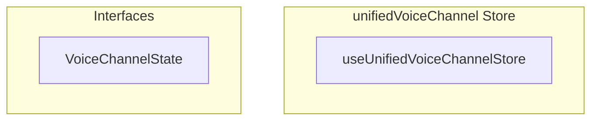

# unifiedVoiceChannel Store

**File:** `src/stores/unifiedVoiceChannel.ts`

## Overview


```mermaid
graph TB
    subgraph "unifiedVoiceChannel Store"
        USEUNIFIEDVOICECHANNELSTORE[useUnifiedVoiceChannelStore]
    end
    
    subgraph "Interfaces"
        INT_VOICECHANNELSTATE[VoiceChannelState]
    end
```


## Exports

- **useUnifiedVoiceChannelStore** - const export


## Interfaces

### VoiceChannelState

No description available.

```typescript
interface VoiceChannelState {

  // Connection info
  currentChannelId: string | null;
  currentServerId: string | null;
  currentChannelName: string | null;
  isConnected: boolean;
  sessionStartTime: Date | null; // Track when the user joined the channel
  callStartTime: Date | null; // Track when the call started (first user joined)
  
  // Users and their states
  allUsers: UserMediaState[];
  localState: UserMediaState;
  
  // Streams
  localStream: MediaStream | null;
  remoteStreams: Map<string, MediaStream>;
  
  //
  // ...
}
```


## Source Code Insights

**File Size:** 32300 characters
**Lines of Code:** 951
**Imports:** 11

## Usage Example

```typescript
import { useUnifiedVoiceChannelStore } from '@/stores/unifiedVoiceChannel'

// Example usage
// Use the exported functionality
```

---

*This documentation was automatically generated from the source code.*