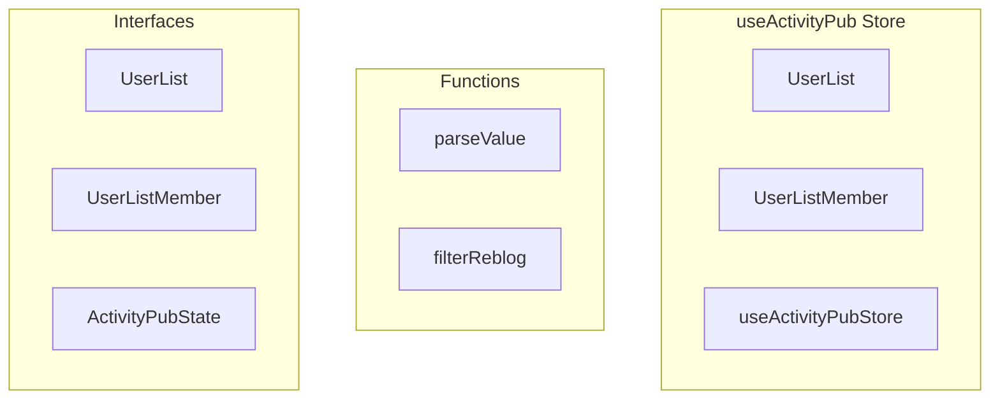

# useActivityPub Store

**File:** `src/stores/useActivityPub.ts`

## Overview




## Exports

- **UserList** - interface export
- **UserListMember** - interface export
- **useActivityPubStore** - const export

## Functions

### `parseValue(val: any)`

No description available.

**Parameters:**
- `val: any`

**Returns:** `Unknown`

```typescript
const parseValue = (val: any) =>
```

### `filterReblog(posts: TimelinePost[])`

No description available.

**Parameters:**
- `posts: TimelinePost[]`

**Returns:** `Unknown`

```typescript
const filterReblog = (posts: TimelinePost[]) =>
```


## Interfaces

### UserList

No description available.

```typescript
interface UserList {

  id: string;
  created_at: string;
  updated_at: string | null;
  user_id: string;
  title: string;
  description: string | null;
  replies_policy: 'followed' | 'list' | 'none';
  is_exclusive: boolean;
  is_public: boolean;
  is_local: boolean;
  federated_id: string | null;
  ap_id: string | null;
  // Computed/joined fields
  members_count?: number;

}
```

### UserListMember

No description available.

```typescript
interface UserListMember {

  id: string;
  created_at: string;
  list_id: string;
  account_id: string;
  // Joined profile data
  account?: {
    id: string;
    username: string;
    display_name: string | null;
    avatar_url: string | null;
    domain: string | null;
    is_local: boolean;
  };

}
```

### ActivityPubState

No description available.

```typescript
interface ActivityPubState {

  // Feed state
  homeFeed: MonyFeed;
  publicFeed: MonyFeed;
  localFeed: MonyFeed;
  userFeeds: Map<string, MonyFeed>;
  
  // Conversation state
  conversations: Map<string, ConversationThread>;
  conversationContexts: Map<string, ConversationContext>;
  
  // User state
  followedUsers: Set<string>;
  blockedUsers: Set<string>;
  mutedUsers: Set<string>;
  
  // Count tracking for realtime updates
  followingCount: number;
  followersCount: number;
  
  // Instance state
  knownInstances: a
  // ...
}
```


## Constants

### CACHE_DURATION

No description available.

```typescript
const CACHE_DURATION = 5 * 60 * 1000
```

### CACHE_MAX_AGE

No description available.

```typescript
const CACHE_MAX_AGE = 30 * 60 * 1000
```


## Source Code Insights

**File Size:** 115192 characters
**Lines of Code:** 3384
**Imports:** 10

## Usage Example

```typescript
import { UserList, UserListMember, useActivityPubStore } from '@/stores/useActivityPub'

// Example usage
parseValue()
```

---

*This documentation was automatically generated from the source code.*