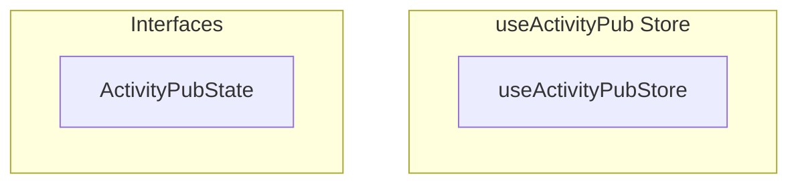

# useActivityPub Store

**File:** `src/stores/useActivityPub.ts`

## Overview


```mermaid
graph TB
    subgraph "useActivityPub Store"
        USEACTIVITYPUBSTORE[useActivityPubStore]
    end
    
    
    
    subgraph "Interfaces"
        ACTIVITYPUBSTATE[ActivityPubState]
    end
```

## Exports

- **useActivityPubStore** - No description


## Interfaces

### ActivityPubState

No description available.

```typescript
interface ActivityPubState {
  // Feed state
  homeFeed: MonyFeed;
  publicFeed: MonyFeed;
  localFeed: MonyFeed;
  userFeeds: Map<string, MonyFeed>;
  
  // Conversation state
  conversations: Map<string, ConversationThread>;
  conversationContexts: Map<string, ConversationContext>;
  
  // User state
  followedUsers: Set<string>;
  blockedUsers: Set<string>;
  mutedUsers: Set<string>;
  
  // Count tracking for realtime updates
  followingCount: number;
  followersCount: number;
  
  // Instance state
  knownInstances: any[];
  blockedInstances: Set<string>;
  
  // UI state
  isComposerOpen: boolean;
  composerState: PostComposerState;
  selectedPost?: Post;
  currentView: 'home' | 'public' | 'local';
  
  // Loading states
  isLoadingFeed: boolean;
  isLoadingPost: boolean;
  isLoadingProfile: boolean;
  isPosting: boolean;
  isLoadingConversation: boolean;
  
  // Realtime subscriptions
  realtimeSubscriptions: Map<string, any>;
  
  // Notification integration
  lastNotificationCheck: Date | null;
  unreadCount: number;
  
  // Bookmarks state
  bookmarks: TimelinePost[];
  hasMoreBookmarks: boolean;
  bookmarksCursor: string | null;
}
```


## Source Code Insights

**File Size:** 67472 characters
**Lines of Code:** 2107
**Imports:** 5

## Usage Example

```typescript
import { useActivityPubStore } from '@/stores/useActivityPub.ts'

// Example usage
// Use the exported functionality
```

---

*This documentation was automatically generated from the source code.*