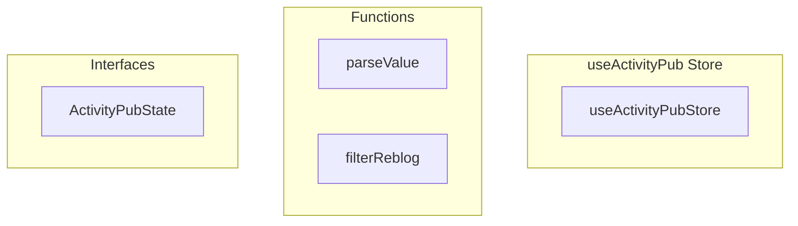

# useActivityPub Store

**File:** `src/stores/useActivityPub.ts`

## Overview


```mermaid
graph TB
    subgraph "useActivityPub Store"
        USEACTIVITYPUBSTORE[useActivityPubStore]
    end
    
    subgraph "Functions"
        FN_PARSEVALUE[parseValue]
        FN_FILTERREBLOG[filterReblog]
    end
    
    subgraph "Interfaces"
        INT_ACTIVITYPUBSTATE[ActivityPubState]
    end
```


## Exports

- **useActivityPubStore** - const export

## Functions

### `parseValue(val: any)`

No description available.

**Parameters:**
- `val: any`

**Returns:** `Unknown`

```typescript
const parseValue = (val: any) =>
```

### `filterReblog(posts: TimelinePost[])`

No description available.

**Parameters:**
- `posts: TimelinePost[]`

**Returns:** `Unknown`

```typescript
const filterReblog = (posts: TimelinePost[]) =>
```


## Interfaces

### ActivityPubState

No description available.

```typescript
interface ActivityPubState {

  // Feed state
  homeFeed: MonyFeed;
  publicFeed: MonyFeed;
  localFeed: MonyFeed;
  userFeeds: Map<string, MonyFeed>;
  
  // Conversation state
  conversations: Map<string, ConversationThread>;
  conversationContexts: Map<string, ConversationContext>;
  
  // User state
  followedUsers: Set<string>;
  blockedUsers: Set<string>;
  mutedUsers: Set<string>;
  
  // Count tracking for realtime updates
  followingCount: number;
  followersCount: number;
  
  // Instance state
  knownInstances: a
  // ...
}
```


## Constants

### CACHE_DURATION

No description available.

```typescript
const CACHE_DURATION = 5 * 60 * 1000
```

### CACHE_MAX_AGE

No description available.

```typescript
const CACHE_MAX_AGE = 30 * 60 * 1000
```


## Source Code Insights

**File Size:** 98672 characters
**Lines of Code:** 2862
**Imports:** 9

## Usage Example

```typescript
import { useActivityPubStore } from '@/stores/useActivityPub'

// Example usage
parseValue()
```

---

*This documentation was automatically generated from the source code.*