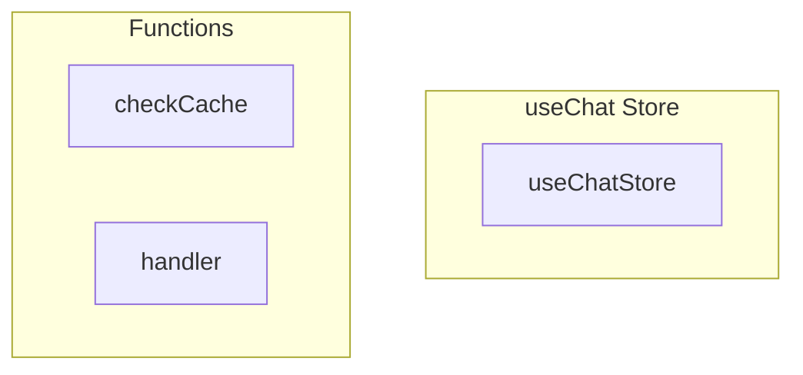

# useChat Store

**File:** `src/stores/useChat.ts`

## Overview




## Exports

- **useChatStore** - const export

## Functions

### `checkCache()`

No description available.

**Parameters:**
None

**Returns:** `Unknown`

```typescript
const checkCache = () =>
```

### `handler()`

No description available.

**Parameters:**
None

**Returns:** `Unknown`

```typescript
const handler = async () =>
```


## Source Code Insights

**File Size:** 40495 characters
**Lines of Code:** 1051
**Imports:** 10

## Usage Example

```typescript
import { useChatStore } from '@/stores/useChat'

// Example usage
checkCache()
```

---

*This documentation was automatically generated from the source code.*