# useDM Store

**File:** `src/stores/useDM.ts`

## Overview

```mermaid
graph TB
    subgraph "useDM Store"
        DMUSER[DMUser]
        DMCONVERSATION[DMConversation]
        DMCACHE[DMCache]
        USEDMSTORE[useDMStore]
    end
    
    subgraph "Functions"
        FN_ISUSERONLINE[isUserOnline]
        FN_EVICTOLDESTCACHE[evictOldestCache]
        FN_ISCACHEVALID[isCacheValid]
        FN_LOADCACHEDMESSAGES[loadCachedMessages]
        FN_ADDMESSAGETOCACHE[addMessageToCache]
        FN_UPDATEMESSAGEINCACHE[updateMessageInCache]
        FN_REPROCESSENCRYPTEDDMMESSAGES[reprocessEncryptedDMMessages]
        FN_SETUPENCRYPTIONKEYLISTENER[setupEncryptionKeyListener]
        FN_REMOVEMESSAGEFROMCACHE[removeMessageFromCache]
        FN_FETCHREPLYMESSAGE[fetchReplyMessage]
        FN_CHECKCACHE[checkCache]
        FN__FETCHSINGLEMESSAGE[_fetchSingleMessage]
        FN_INITIALIZEDMENVIRONMENT[initializeDMEnvironment]
        FN_FETCHUSERCONVERSATIONSMETADATA[fetchUserConversationsMetadata]
        FN_FETCHPROMISE[fetchPromise]
        FN_FETCHCONVERSATIONDETAILS[fetchConversationDetails]
        FN__FETCHSPECIFICCONVERSATION[_fetchSpecificConversation]
        FN_INITIALIZEDMENVIRONMENTFORDIRE[initializeDMEnvironmentForDirectAccess]
        FN_FETCHUSERCONVERSATIONS[fetchUserConversations]
        FN__FETCHRAWCONVERSATIONS[_fetchRawConversations]
        FN__PRELOADUSERPROFILES[_preloadUserProfiles]
        FN__PROCESSCONVERSATIONDATA[_processConversationData]
        FN__FETCHUSERPROFILE[_fetchUserProfile]
        FN__NORMALIZEUSEROBJECT[_normalizeUserObject]
        FN__FETCHLASTMESSAGE[_fetchLastMessage]
        FN_FETCHCONVERSATIONMESSAGES[fetchConversationMessages]
        FN_SEARCHUSERS[searchUsers]
        FN__SEARCHLOCALUSERS[_searchLocalUsers]
        FN_CREATEORGETCONVERSATION[createOrGetConversation]
        FN__CREATEORFINDCONVERSATION[_createOrFindConversation]
        FN_SENDDMMESSAGE[sendDMMessage]
        FN_SETCURRENTCONVERSATION[setCurrentConversation]
        FN_SWITCHTOCONVERSATION[switchToConversation]
        FN_CLEARDMMESSAGES[clearDMMessages]
        FN_CLEANUPREALTIMESUBSCRIPTIONS[cleanupRealtimeSubscriptions]
        FN_CLEANUPCONVERSATIONSUBSCRIPTIO[cleanupConversationSubscription]
        FN_SETUPREALTIMESUBSCRIPTIONS[setupRealtimeSubscriptions]
        FN_REACTIONSUNSUBSCRIBE[reactionsUnsubscribe]
        FN_SETUPCONVERSATIONSUBSCRIPTION[setupConversationSubscription]
        FN_UPDATECONVERSATIONFROMMESSAGE[updateConversationFromMessage]
        FN_CLEANUP[cleanup]
        FN_PROCESSFEDERATEDDM[processFederatedDM]
        FN_VALIDATEMENTIONTAG[validateMentionTag]
        FN_GENERATEACTIVITYPUBMENTIONTAGS[generateActivityPubMentionTags]
        FN_DEBUGCONVERSATIONQUERIES[debugConversationQueries]
        FN_CHECKMIGRATIONSTATUS[checkMigrationStatus]
        FN_CREATEGROUPCONVERSATION[createGroupConversation]
        FN_ADDUSERSTOCONVERSATION[addUsersToConversation]
        FN_GETCONVERSATIONPARTICIPANTS[getConversationParticipants]
        FN_FEDERATEGROUPDMMESSAGE[federateGroupDMMessage]
        FN_LOADCONVERSATIONUSERPROFILE[loadConversationUserProfile]
        FN_LOADMULTIPLECONVERSATIONUSERPR[loadMultipleConversationUserProfiles]
    end
    
    subgraph "Interfaces"
        INT_DMUSER[DMUser]
        INT_DMCONVERSATION[DMConversation]
        INT_DMCACHE[DMCache]
    end
```




## Exports

- **DMUser** - interface export
- **DMConversation** - interface export
- **DMCache** - interface export
- **useDMStore** - const export

## Functions

### `isUserOnline(userId: string)`

No description available.

**Parameters:**
- `userId: string`

**Returns:** `Promise&lt;boolean&gt;`

```typescript
const isUserOnline = async (userId: string): Promise<boolean> =>
```

### `evictOldestCache()`

No description available.

**Parameters:**
None

**Returns:** `Unknown`

```typescript
const evictOldestCache = () =>
```

### `isCacheValid(conversationId: string)`

No description available.

**Parameters:**
- `conversationId: string`

**Returns:** `boolean`

```typescript
const isCacheValid = (conversationId: string): boolean =>
```

### `loadCachedMessages(conversationId: string)`

No description available.

**Parameters:**
- `conversationId: string`

**Returns:** `Unknown`

```typescript
const loadCachedMessages = (conversationId: string) =>
```

### `addMessageToCache(message: Message)`

No description available.

**Parameters:**
- `message: Message`

**Returns:** `Unknown`

```typescript
const addMessageToCache = (message: Message) =>
```

### `updateMessageInCache(messageId: string, updatedMessage: Message)`

No description available.

**Parameters:**
- `messageId: string`
- `updatedMessage: Message`

**Returns:** `Unknown`

```typescript
const updateMessageInCache = (messageId: string, updatedMessage: Message) =>
```

### `reprocessEncryptedDMMessages()`

No description available.

**Parameters:**
None

**Returns:** `Unknown`

```typescript
const reprocessEncryptedDMMessages = async () =>
```

### `setupEncryptionKeyListener()`

No description available.

**Parameters:**
None

**Returns:** `Unknown`

```typescript
const setupEncryptionKeyListener = () =>
```

### `removeMessageFromCache(messageId: string)`

No description available.

**Parameters:**
- `messageId: string`

**Returns:** `Unknown`

```typescript
const removeMessageFromCache = (messageId: string) =>
```

### `fetchReplyMessage(messageId: string)`

No description available.

**Parameters:**
- `messageId: string`

**Returns:** `Promise&lt;Message | null&gt;`

```typescript
const fetchReplyMessage = async (messageId: string): Promise<Message | null> =>
```

### `checkCache()`

No description available.

**Parameters:**
None

**Returns:** `Unknown`

```typescript
const checkCache = () =>
```

### `_fetchSingleMessage(messageId: string)`

No description available.

**Parameters:**
- `messageId: string`

**Returns:** `Promise&lt;Message | null&gt;`

```typescript
const _fetchSingleMessage = async (messageId: string): Promise<Message | null> =>
```

### `initializeDMEnvironment(userId: string, forceRefresh = false, metadataOnly = false, loadStrategy: 'lazy' | 'partial' | 'immediate' = 'partial')`

No description available.

**Parameters:**
- `userId: string`
- `forceRefresh = false`
- `metadataOnly = false`
- `loadStrategy: 'lazy' | 'partial' | 'immediate' = 'partial'`

**Returns:** `Unknown`

```typescript
/**
   * Initialize DM environment with configurable loading strategies:
   * - 'lazy': User profiles load only on hover (maximum performance, placeholder UX)
   * - 'partial': Load user profiles for 20 most recent conversations immediately (balanced)
   * - 'immediate': Load ALL user profiles right away (best UX, more database load)
   */
  const initializeDMEnvironment = async (userId: string, forceRefresh = false, metadataOnly = false, loadStrategy: 'lazy' | 'partial' | 'immediate' = 'partial') =>
```

### `fetchUserConversationsMetadata(userId: string, loadStrategy: 'lazy' | 'partial' | 'immediate' = 'partial')`

No description available.

**Parameters:**
- `userId: string`
- `loadStrategy: 'lazy' | 'partial' | 'immediate' = 'partial'`

**Returns:** `Unknown`

```typescript
const fetchUserConversationsMetadata = async (userId: string, loadStrategy: 'lazy' | 'partial' | 'immediate' = 'partial') =>
```

### `fetchPromise(async ()`

No description available.

**Parameters:**
- `async (`

**Returns:** `Unknown`

```typescript
const fetchPromise = (async () =>
```

### `fetchConversationDetails(conversationId: string, currentUserId: string)`

No description available.

**Parameters:**
- `conversationId: string`
- `currentUserId: string`

**Returns:** `Unknown`

```typescript
const fetchConversationDetails = async (conversationId: string, currentUserId: string) =>
```

### `_fetchSpecificConversation(conversationId: string)`

No description available.

**Parameters:**
- `conversationId: string`

**Returns:** `Unknown`

```typescript
const _fetchSpecificConversation = async (conversationId: string) =>
```

### `initializeDMEnvironmentForDirectAccess(userId: string, conversationId?: string)`

No description available.

**Parameters:**
- `userId: string`
- `conversationId?: string`

**Returns:** `Unknown`

```typescript
const initializeDMEnvironmentForDirectAccess = async (userId: string, conversationId?: string) =>
```

### `fetchUserConversations(userId: string)`

No description available.

**Parameters:**
- `userId: string`

**Returns:** `Unknown`

```typescript
const fetchUserConversations = async (userId: string) =>
```

### `_fetchRawConversations(userId: string)`

No description available.

**Parameters:**
- `userId: string`

**Returns:** `Unknown`

```typescript
const _fetchRawConversations = async (userId: string) =>
```

### `_preloadUserProfiles(conversationsData: any[])`

No description available.

**Parameters:**
- `conversationsData: any[]`

**Returns:** `Unknown`

```typescript
const _preloadUserProfiles = async (conversationsData: any[]) =>
```

### `_processConversationData(conv: any, userId: string)`

No description available.

**Parameters:**
- `conv: any`
- `userId: string`

**Returns:** `Promise&lt;DMConversation | null&gt;`

```typescript
const _processConversationData = async (conv: any, userId: string): Promise<DMConversation | null> =>
```

### `_fetchUserProfile(userId: string)`

No description available.

**Parameters:**
- `userId: string`

**Returns:** `Unknown`

```typescript
const _fetchUserProfile = async (userId: string) =>
```

### `_normalizeUserObject(user: any)`

No description available.

**Parameters:**
- `user: any`

**Returns:** `DMUser`

```typescript
const _normalizeUserObject = (user: any): DMUser =>
```

### `_fetchLastMessage(conversationId: string)`

No description available.

**Parameters:**
- `conversationId: string`

**Returns:** `Unknown`

```typescript
const _fetchLastMessage = async (conversationId: string) =>
```

### `fetchConversationMessages(conversationId: string, beforeMessageId?: string, signal?: AbortSignal)`

No description available.

**Parameters:**
- `conversationId: string`
- `beforeMessageId?: string`
- `signal?: AbortSignal`

**Returns:** `Unknown`

```typescript
const fetchConversationMessages = async (conversationId: string, beforeMessageId?: string, signal?: AbortSignal) =>
```

### `searchUsers(query: string, currentUserId: string)`

No description available.

**Parameters:**
- `query: string`
- `currentUserId: string`

**Returns:** `Unknown`

```typescript
const searchUsers = async (query: string, currentUserId: string) =>
```

### `_searchLocalUsers(query: string, currentUserId: string)`

No description available.

**Parameters:**
- `query: string`
- `currentUserId: string`

**Returns:** `Unknown`

```typescript
const _searchLocalUsers = async (query: string, currentUserId: string) =>
```

### `createOrGetConversation(user1Id: string, user2Id: string)`

No description available.

**Parameters:**
- `user1Id: string`
- `user2Id: string`

**Returns:** `Promise&lt;string | null&gt;`

```typescript
const createOrGetConversation = async (user1Id: string, user2Id: string): Promise<string | null> =>
```

### `_createOrFindConversation(user1Id: string, user2Id: string)`

No description available.

**Parameters:**
- `user1Id: string`
- `user2Id: string`

**Returns:** `Promise&lt;string | null&gt;`

```typescript
const _createOrFindConversation = async (user1Id: string, user2Id: string): Promise<string | null> =>
```

### `sendDMMessage(conversationId: string, userId: string, content: MessagePart[], replyTo?: string)`

No description available.

**Parameters:**
- `conversationId: string`
- `userId: string`
- `content: MessagePart[]`
- `replyTo?: string`

**Returns:** `Promise&lt;boolean&gt;`

```typescript
const sendDMMessage = async (
    conversationId: string,
    userId: string,
    content: MessagePart[],
    replyTo?: string
  ): Promise<boolean> =>
```

### `setCurrentConversation(conversationId: string | null)`

No description available.

**Parameters:**
- `conversationId: string | null`

**Returns:** `Unknown`

```typescript
const setCurrentConversation = (conversationId: string | null) =>
```

### `switchToConversation(conversationId: string)`

No description available.

**Parameters:**
- `conversationId: string`

**Returns:** `Unknown`

```typescript
const switchToConversation = async (conversationId: string) =>
```

### `clearDMMessages()`

No description available.

**Parameters:**
None

**Returns:** `Unknown`

```typescript
const clearDMMessages = () =>
```

### `cleanupRealtimeSubscriptions()`

No description available.

**Parameters:**
None

**Returns:** `Unknown`

```typescript
const cleanupRealtimeSubscriptions = () =>
```

### `cleanupConversationSubscription(conversationId: string)`

No description available.

**Parameters:**
- `conversationId: string`

**Returns:** `Unknown`

```typescript
const cleanupConversationSubscription = (conversationId: string) =>
```

### `setupRealtimeSubscriptions(userId: string)`

No description available.

**Parameters:**
- `userId: string`

**Returns:** `Unknown`

```typescript
/**
   * Setup global DM realtime subscriptions using RealtimeConnectionManager
   * Includes conversations updates and reactions
   */
  const setupRealtimeSubscriptions = async (userId: string) =>
```

### `reactionsUnsubscribe()`

No description available.

**Parameters:**
None

**Returns:** `Unknown`

```typescript
const reactionsUnsubscribe = () =>
```

### `setupConversationSubscription(conversationId: string)`

No description available.

**Parameters:**
- `conversationId: string`

**Returns:** `Unknown`

```typescript
/**
   * Setup subscription for a specific DM conversation using RealtimeConnectionManager
   * Handles INSERT, UPDATE, DELETE events with automatic reconnection
   */
  const setupConversationSubscription = (conversationId: string) =>
```

### `updateConversationFromMessage(message: any)`

No description available.

**Parameters:**
- `message: any`

**Returns:** `Unknown`

```typescript
const updateConversationFromMessage = (message: any) =>
```

### `cleanup()`

No description available.

**Parameters:**
None

**Returns:** `Unknown`

```typescript
const cleanup = () =>
```

### `processFederatedDM(activity: any, note: any)`

No description available.

**Parameters:**
- `activity: any`
- `note: any`

**Returns:** `Unknown`

```typescript
const processFederatedDM = async (activity: any, note: any) =>
```

### `validateMentionTag(tag: any)`

No description available.

**Parameters:**
- `tag: any`

**Returns:** `boolean`

```typescript
const validateMentionTag = (tag: any): boolean =>
```

### `generateActivityPubMentionTags(content: MessagePart[], recipientUrls: string[], instanceDomain: string)`

No description available.

**Parameters:**
- `content: MessagePart[]`
- `recipientUrls: string[]`
- `instanceDomain: string`

**Returns:** `any[]`

```typescript
const generateActivityPubMentionTags = (
    content: MessagePart[], 
    recipientUrls: string[], 
    instanceDomain: string
  ): any[] =>
```

### `debugConversationQueries(userId?: string)`

No description available.

**Parameters:**
- `userId?: string`

**Returns:** `Unknown`

```typescript
const debugConversationQueries = async (userId?: string) =>
```

### `checkMigrationStatus()`

No description available.

**Parameters:**
None

**Returns:** `Unknown`

```typescript
const checkMigrationStatus = async () =>
```

### `createGroupConversation(options: {
    participantIds: string[] // User IDs
    name?: string
    isPrivate?: boolean
  })`

No description available.

**Parameters:**
- `options: {
    participantIds: string[] // User IDs
    name?: string
    isPrivate?: boolean
  }`

**Returns:** `Promise&lt;string | null&gt;`

```typescript
/**
   * Create a group conversation with multiple participants
   */
  const createGroupConversation = async (options: {
    participantIds: string[] // User IDs
    name?: string
    isPrivate?: boolean
  }): Promise<string | null> =>
```

### `addUsersToConversation(conversationId: string, userIds: string[], currentUserId: string)`

No description available.

**Parameters:**
- `conversationId: string`
- `userIds: string[]`
- `currentUserId: string`

**Returns:** `Promise&lt;boolean | string&gt;`

```typescript
/**
   * Add users to an existing conversation (convert 1:1 to group or add to group)
   */
  const addUsersToConversation = async (
    conversationId: string,
    userIds: string[],
    currentUserId: string
  ): Promise<boolean | string> =>
```

### `getConversationParticipants(conversationId: string)`

No description available.

**Parameters:**
- `conversationId: string`

**Returns:** `Promise&lt;DMUser[]&gt;`

```typescript
/**
   * Get all participants of a conversation
   */
  const getConversationParticipants = async (conversationId: string): Promise<DMUser[]> =>
```

### `federateGroupDMMessage(message: any, participants: DMUser[])`

No description available.

**Parameters:**
- `message: any`
- `participants: DMUser[]`

**Returns:** `Promise&lt;boolean&gt;`

```typescript
/**
   * ActivityPub federation for group DMs
   * 
   * NOTE: Federation is handled AUTOMATICALLY by the federation-backend service.
   * The DatabaseListener.handleNewDM() function handles:
   * 1. Getting all conversation participants
   * 2. Filtering to remote/federated users only
   * 3. Creating private ActivityPub Notes with direct addressing (to: [recipient])
   * 4. Adding proper mention tags for all participants
   * 5. Delivering to each external participant's inbox via DeliveryQueue
   * 6. Handling delivery failures and retries
   * 
   * This client-side function is for validation/logging only.
   * The actual federation happens when a message is inserted into the messages table.
   * 
   * @see federation-backend/src/listeners/DatabaseListener.ts handleNewDM()
   */
  const federateGroupDMMessage = async (
    message: any,
    participants: DMUser[]
  ): Promise<boolean> =>
```

### `loadConversationUserProfile(conversationId: string)`

No description available.

**Parameters:**
- `conversationId: string`

**Returns:** `Promise&lt;boolean&gt;`

```typescript
const loadConversationUserProfile = async (conversationId: string): Promise<boolean> =>
```

### `loadMultipleConversationUserProfiles(conversationIds: string[])`

No description available.

**Parameters:**
- `conversationIds: string[]`

**Returns:** `Promise&lt;void&gt;`

```typescript
const loadMultipleConversationUserProfiles = async (conversationIds: string[]): Promise<void> =>
```


## Interfaces

### DMUser

No description available.

```typescript
interface DMUser {

  id: string
  username: string
  display_name?: string
  avatar_url?: string
  is_online?: boolean
  last_seen?: string
  // Federated user support
  domain?: string
  is_local?: boolean
  federated_id?: string
  handle?: string
  color?: string // Optional color for UI
  // Optimization: Track if this is placeholder data that needs to be loaded
  _isPlaceholder?: boolean

}
```

### DMConversation

No description available.

```typescript
interface DMConversation {

  id: string
  created_at: string
  last_activity?: string
  last_message?: Message
  unread_count?: number
  other_user?: DMUser // For direct conversations
  type?: string // 'direct' | 'group'
  participant_count?: number
  
  // Group conversation fields
  name?: string // Group name
  icon_url?: string // Group icon
  created_by?: string // Creator user ID
  participants?: DMUser[] // All participants for group chats

}
```

### DMCache

No description available.

```typescript
interface DMCache {

  messages: Message[]
  lastFetchedAt: Date
  oldestMessageId: string | null
  allMessagesLoaded: boolean
  lastModified: Date

}
```


## Source Code Insights

**File Size:** 94702 characters
**Lines of Code:** 2573
**Imports:** 13

## Usage Example

```typescript
import { DMUser, DMConversation, DMCache, useDMStore } from '@/stores/useDM'

// Example usage
isUserOnline()
```

---

*This documentation was automatically generated from the source code.*