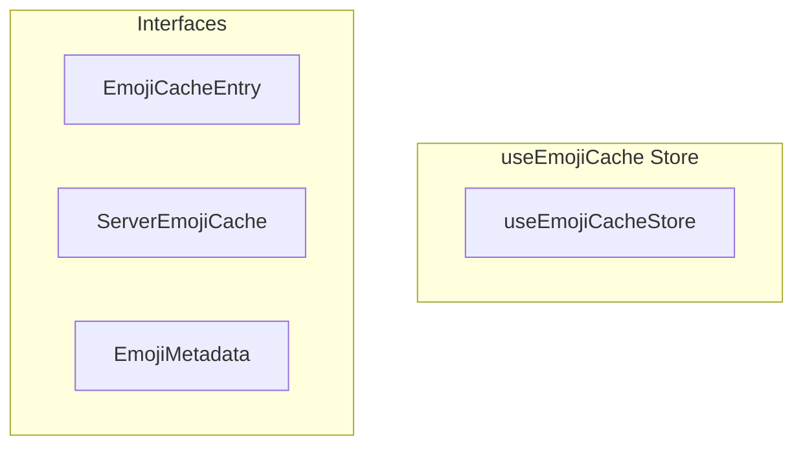

# useEmojiCache Store

**File:** `src/stores/useEmojiCache.ts`

## Overview




## Exports

- **useEmojiCacheStore** - const export


## Interfaces

### EmojiCacheEntry

No description available.

```typescript
interface EmojiCacheEntry {

  emoji: Emoji;
  lastUpdated: Date;
  accessCount: number;
  lastAccessed: Date;

}
```

### ServerEmojiCache

No description available.

```typescript
interface ServerEmojiCache {

  serverId: string;
  serverName: string;
  serverIcon?: string;
  emojis: Map<string, EmojiCacheEntry>;
  lastFetched: Date;
  isStale: boolean;
  allowCrossServer: boolean;

}
```

### EmojiMetadata

No description available.

```typescript
interface EmojiMetadata {

  serverId: string;
  lastModified: Date;
  count: number;

}
```


## Source Code Insights

**File Size:** 23711 characters
**Lines of Code:** 730
**Imports:** 5

## Usage Example

```typescript
import { useEmojiCacheStore } from '@/stores/useEmojiCache'

// Example usage
// Use the exported functionality
```

---

*This documentation was automatically generated from the source code.*