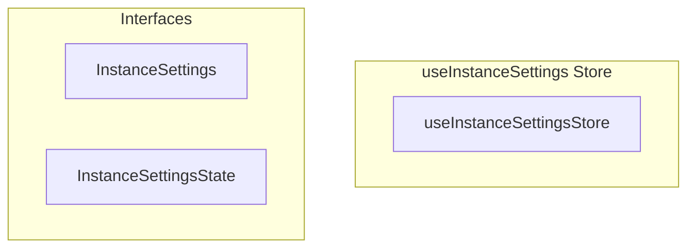

# useInstanceSettings Store

**File:** `src/stores/useInstanceSettings.ts`

## Overview




## Exports

- **useInstanceSettingsStore** - const export


## Interfaces

### InstanceSettings

No description available.

```typescript
interface InstanceSettings {

  // Instance identity
  domain: string
  instanceName: string
  instanceDescription: string
  
  // Legal / policy URLs
  termsUrl: string
  privacyUrl: string
  
  // Registration
  openRegistration: boolean
  approvalRequired: boolean
  
  // Federation settings (affects UI visibility)
  federationEnabled: boolean
  federationInboundEnabled: boolean
  federationOutboundEnabled: boolean
  
  // Feature flags
  voiceChannelsEnabled: boolean
  fileUploadsEnabled: boolean
  
  // Limits
  maxPos
  // ...
}
```

### InstanceSettingsState

No description available.

```typescript
interface InstanceSettingsState {

  settings: InstanceSettings
  isLoaded: boolean
  isLoading: boolean
  lastFetchedAt: number | null

}
```


## Constants

### DEFAULT_SETTINGS

No description available.

```typescript
const DEFAULT_SETTINGS: InstanceSettings = {
```

### CACHE_DURATION

No description available.

```typescript
const CACHE_DURATION = 5 * 60 * 1000
```


## Source Code Insights

**File Size:** 8072 characters
**Lines of Code:** 267
**Imports:** 3

## Usage Example

```typescript
import { useInstanceSettingsStore } from '@/stores/useInstanceSettings'

// Example usage
// Use the exported functionality
```

---

*This documentation was automatically generated from the source code.*