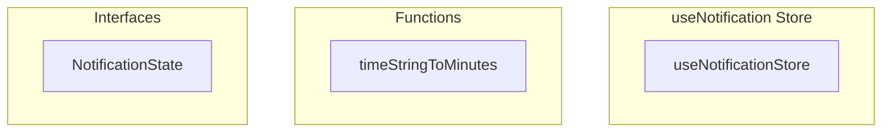

# useNotification Store

**File:** `src/stores/useNotification.ts`

## Overview




## Exports

- **useNotificationStore** - const export

## Functions

### `timeStringToMinutes(timeString: string)`

No description available.

**Parameters:**
- `timeString: string`

**Returns:** `number`

```typescript
function timeStringToMinutes(timeString: string): number
```


## Interfaces

### NotificationState

No description available.

```typescript
interface NotificationState {

  notifications: Notification[]
  unreadCount: number
  isLoading: boolean
  lastFetchedAt: Date | null
  preferences: NotificationPreferences | null
  isDndActive: boolean
  toasts: NotificationToast[]
  realtimeSubscription: any
  lastNotificationTime: Map<string, number>
  isInitialized: boolean
  hasPermission: boolean
  currentFilter: string
  // Cache for profileId to avoid repeated lookups
  cachedProfileId: string | null
  cachedAuthUserId: string | null

}
```


## Constants

### NOTIFICATION_SOUND_MAPPING

No description available.

```typescript
const NOTIFICATION_SOUND_MAPPING: Record<NotificationType, AudioAction> = {
```

### DEFAULT_PREFERENCES

No description available.

```typescript
const DEFAULT_PREFERENCES: Omit<NotificationPreferences, 'id' | 'user_id' | 'created_at' | 'updated_at'> = {
```

### NOTIFICATION_RETRY_CONFIG

No description available.

```typescript
const NOTIFICATION_RETRY_CONFIG = {
```


## Source Code Insights

**File Size:** 44929 characters
**Lines of Code:** 1318
**Imports:** 11

## Usage Example

```typescript
import { useNotificationStore } from '@/stores/useNotification'

// Example usage
timeStringToMinutes()
```

---

*This documentation was automatically generated from the source code.*