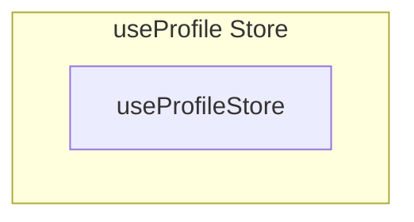

# useProfile Store

**File:** `src/stores/useProfile.ts`

## Overview




## Exports

- **useProfileStore** - const export


## Source Code Insights

**File Size:** 5038 characters
**Lines of Code:** 142
**Imports:** 5

## Usage Example

```typescript
import { useProfileStore } from '@/stores/useProfile'

// Example usage
// Use the exported functionality
```

---

*This documentation was automatically generated from the source code.*