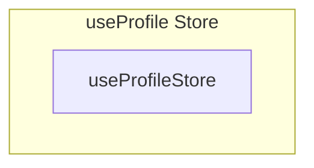

# useProfile Store

**File:** `src/stores/useProfile.ts`

## Overview


```mermaid
graph TB
    subgraph "useProfile Store"
        USEPROFILESTORE[useProfileStore]
    end
    
    
    
    
```

## Exports

- **useProfileStore** - No description


## Source Code Insights

**File Size:** 4416 characters
**Lines of Code:** 137
**Imports:** 4

## Usage Example

```typescript
import { useProfileStore } from '@/stores/useProfile.ts'

// Example usage
// Use the exported functionality
```

---

*This documentation was automatically generated from the source code.*