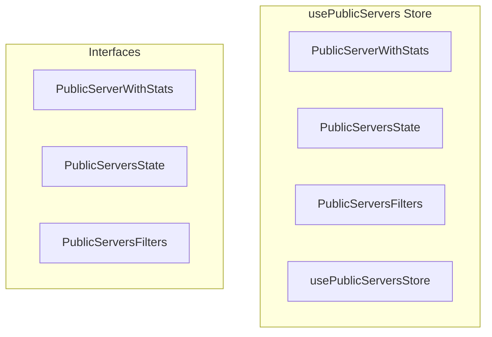

# usePublicServers Store

**File:** `src/stores/usePublicServers.ts`

## Overview




## Exports

- **PublicServerWithStats** - interface export
- **PublicServersState** - interface export
- **PublicServersFilters** - interface export
- **usePublicServersStore** - const export


## Interfaces

### PublicServerWithStats

No description available.

```typescript
interface PublicServerWithStats {

  member_count?: number
  is_featured?: boolean
  category?: string
  last_activity?: string

}
```

### PublicServersState

No description available.

```typescript
interface PublicServersState {

  servers: PublicServerWithStats[]
  searchResults: PublicServerWithStats[]
  categories: string[]
  isLoading: boolean
  isSearching: boolean
  searchQuery: string
  selectedCategory: string | null
  error: string | null
  hasLoaded: boolean
  lastFetchTime: number | null

}
```

### PublicServersFilters

No description available.

```typescript
interface PublicServersFilters {

  category?: string
  minMembers?: number
  maxMembers?: number
  sortBy?: 'name' | 'members' | 'activity' | 'created'
  sortOrder?: 'asc' | 'desc'

}
```


## Source Code Insights

**File Size:** 11113 characters
**Lines of Code:** 349
**Imports:** 4

## Usage Example

```typescript
import { PublicServerWithStats, PublicServersState, PublicServersFilters, usePublicServersStore } from '@/stores/usePublicServers'

// Example usage
// Use the exported functionality
```

---

*This documentation was automatically generated from the source code.*