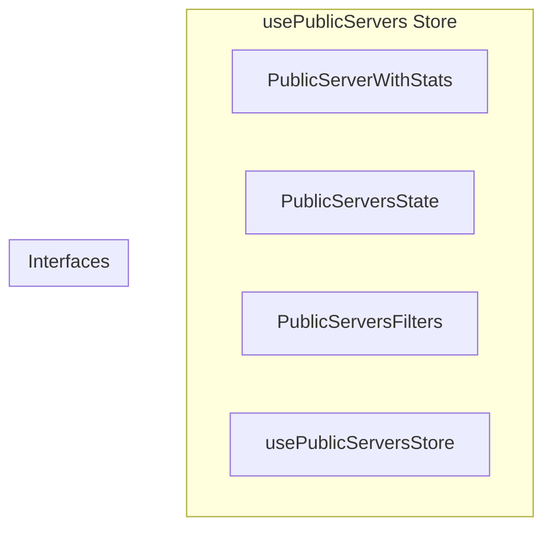

# usePublicServers Store

**File:** `src/stores/usePublicServers.ts`

## Overview


```mermaid
graph TB
    subgraph "usePublicServers Store"
        PUBLICSERVERWITHSTATS[PublicServerWithStats]
        PUBLICSERVERSSTATE[PublicServersState]
        PUBLICSERVERSFILTERS[PublicServersFilters]
        USEPUBLICSERVERSSTORE[usePublicServersStore]
    end
    
    
    
    subgraph "Interfaces"
        PUBLICSERVERWITHSTATS[PublicServerWithStats]
        PUBLICSERVERSSTATE[PublicServersState]
        PUBLICSERVERSFILTERS[PublicServersFilters]
    end
```

## Exports

- **PublicServerWithStats** - No description
- **PublicServersState** - No description
- **PublicServersFilters** - No description
- **usePublicServersStore** - No description


## Interfaces

### PublicServerWithStats

No description available.

```typescript
export interface PublicServerWithStats extends Server {
  member_count?: number
  is_featured?: boolean
  category?: string
  last_activity?: string
}
```

### PublicServersState

No description available.

```typescript
export interface PublicServersState {
  servers: PublicServerWithStats[]
  searchResults: PublicServerWithStats[]
  categories: string[]
  isLoading: boolean
  isSearching: boolean
  searchQuery: string
  selectedCategory: string | null
  error: string | null
  hasLoaded: boolean
  lastFetchTime: number | null
}
```

### PublicServersFilters

No description available.

```typescript
export interface PublicServersFilters {
  category?: string
  minMembers?: number
  maxMembers?: number
  sortBy?: 'name' | 'members' | 'activity' | 'created'
  sortOrder?: 'asc' | 'desc'
}
```


## Source Code Insights

**File Size:** 10924 characters
**Lines of Code:** 347
**Imports:** 3

## Usage Example

```typescript
import { PublicServerWithStats, PublicServersState, PublicServersFilters, usePublicServersStore } from '@/stores/usePublicServers.ts'

// Example usage
// Use the exported functionality
```

---

*This documentation was automatically generated from the source code.*