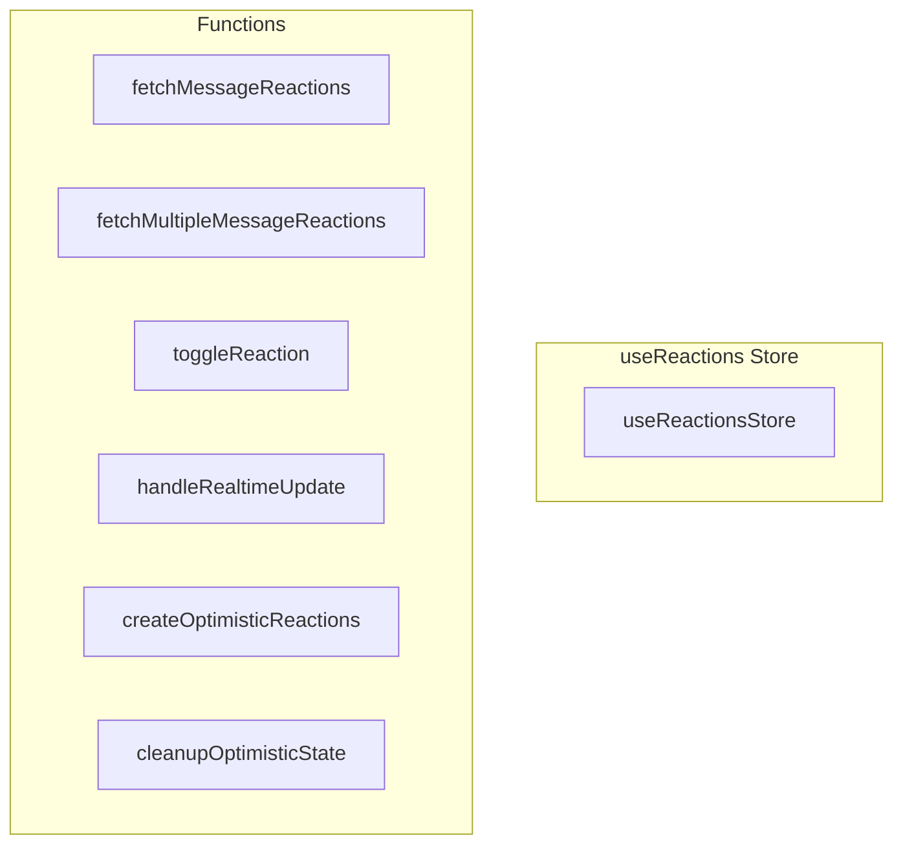

# useReactions Store

**File:** `src/stores/useReactions.ts`

## Overview




## Exports

- **useReactionsStore** - const export

## Functions

### `fetchMessageReactions(messageId: string, force = false)`

No description available.

**Parameters:**
- `messageId: string`
- `force = false`

**Returns:** `Promise&lt;void&gt;`

```typescript
async function fetchMessageReactions(messageId: string, force = false): Promise<void>
```

### `fetchMultipleMessageReactions(messageIds: string[], force = false)`

No description available.

**Parameters:**
- `messageIds: string[]`
- `force = false`

**Returns:** `Promise&lt;void&gt;`

```typescript
/**
   * CRITICAL: Batch fetch reactions for multiple messages to avoid N+1 queries
   * This is essential for performance when loading chat history
   */
  async function fetchMultipleMessageReactions(messageIds: string[], force = false): Promise<void>
```

### `toggleReaction(messageId: string, emojiId: string, userId: string, emojiData?: Emoji)`

No description available.

**Parameters:**
- `messageId: string`
- `emojiId: string`
- `userId: string`
- `emojiData?: Emoji`

**Returns:** `Promise&lt;`

```typescript
/**
   * SIMPLE reaction toggle with instant UI feedback
   * emojiData is optional - if provided, uses it immediately for zero-delay rendering
   */
  async function toggleReaction(
    messageId: string, 
    emojiId: string, 
    userId: string, 
    emojiData?: Emoji
  ): Promise<
```

### `handleRealtimeUpdate(payload: any)`

No description available.

**Parameters:**
- `payload: any`

**Returns:** `Promise&lt;void&gt;`

```typescript
/**
   * SMART realtime handling - works with optimistic state
   */
  async function handleRealtimeUpdate(payload: any): Promise<void>
```

### `createOptimisticReactions(baseReactions: ReactionGroup[], emojiId: string, userId: string, operation: 'add' | 'remove', providedEmojiData?: Emoji)`

No description available.

**Parameters:**
- `baseReactions: ReactionGroup[]`
- `emojiId: string`
- `userId: string`
- `operation: 'add' | 'remove'`
- `providedEmojiData?: Emoji`

**Returns:** `ReactionGroup[]`

```typescript
/**
    * SIMPLE helper: Create optimistic reaction state
    */
   function createOptimisticReactions(
     baseReactions: ReactionGroup[], 
     emojiId: string, 
     userId: string, 
     operation: 'add' | 'remove',
     providedEmojiData?: Emoji
   ): ReactionGroup[]
```

### `cleanupOptimisticState()`

No description available.

**Parameters:**
None

**Returns:** `void`

```typescript
/**
    * SMART cleanup for optimistic state - let successful reactions stay
    */
   function cleanupOptimisticState(): void
```


## Source Code Insights

**File Size:** 14156 characters
**Lines of Code:** 401
**Imports:** 7

## Usage Example

```typescript
import { useReactionsStore } from '@/stores/useReactions'

// Example usage
fetchMessageReactions()
```

---

*This documentation was automatically generated from the source code.*