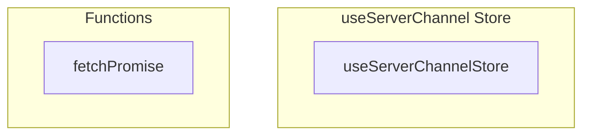

# useServerChannel Store

**File:** `src/stores/useServerChannel.ts`

## Overview




## Exports

- **useServerChannelStore** - const export

## Functions

### `fetchPromise(async ()`

No description available.

**Parameters:**
- `async (`

**Returns:** `Unknown`

```typescript
const fetchPromise = (async () =>
```


## Constants

### MAX_CATEGORIES_PER_SERVER

No description available.

```typescript
const MAX_CATEGORIES_PER_SERVER = 25
```


## Source Code Insights

**File Size:** 98954 characters
**Lines of Code:** 2697
**Imports:** 9

## Usage Example

```typescript
import { useServerChannelStore } from '@/stores/useServerChannel'

// Example usage
fetchPromise()
```

---

*This documentation was automatically generated from the source code.*