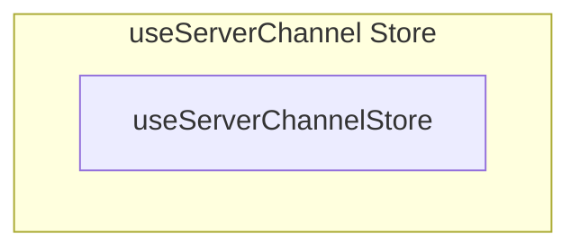

# useServerChannel Store

**File:** `src/stores/useServerChannel.ts`

## Overview


```mermaid
graph TB
    subgraph "useServerChannel Store"
        USESERVERCHANNELSTORE[useServerChannelStore]
    end
    
    
    
    
```

## Exports

- **useServerChannelStore** - No description


## Source Code Insights

**File Size:** 25567 characters
**Lines of Code:** 737
**Imports:** 5

## Usage Example

```typescript
import { useServerChannelStore } from '@/stores/useServerChannel.ts'

// Example usage
// Use the exported functionality
```

---

*This documentation was automatically generated from the source code.*