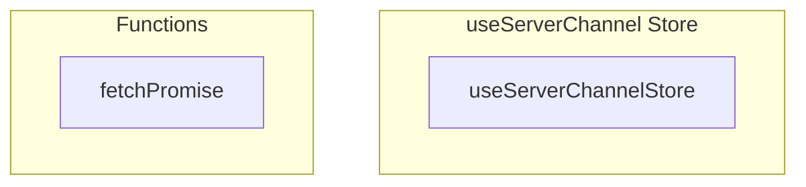

# useServerChannel Store

**File:** `src/stores/useServerChannel.ts`

## Overview


```mermaid
graph TB
    subgraph "useServerChannel Store"
        USESERVERCHANNELSTORE[useServerChannelStore]
    end
    
    subgraph "Functions"
        FN_FETCHPROMISE[fetchPromise]
    end
```


## Exports

- **useServerChannelStore** - const export

## Functions

### `fetchPromise(async ()`

No description available.

**Parameters:**
- `async (`

**Returns:** `Unknown`

```typescript
const fetchPromise = (async () =>
```


## Source Code Insights

**File Size:** 78931 characters
**Lines of Code:** 2157
**Imports:** 9

## Usage Example

```typescript
import { useServerChannelStore } from '@/stores/useServerChannel'

// Example usage
fetchPromise()
```

---

*This documentation was automatically generated from the source code.*