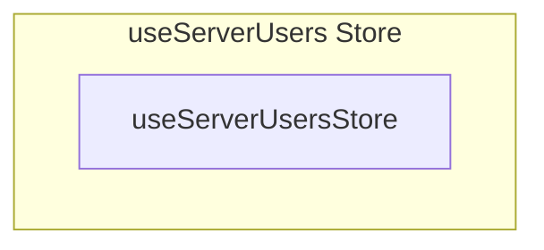

# useServerUsers Store

**File:** `src/stores/useServerUsers.ts`

## Overview




## Exports

- **useServerUsersStore** - const export


## Source Code Insights

**File Size:** 24795 characters
**Lines of Code:** 615
**Imports:** 10

## Usage Example

```typescript
import { useServerUsersStore } from '@/stores/useServerUsers'

// Example usage
// Use the exported functionality
```

---

*This documentation was automatically generated from the source code.*