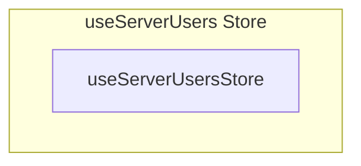

# useServerUsers Store

**File:** `src/stores/useServerUsers.ts`

## Overview


```mermaid
graph TB
    subgraph "useServerUsers Store"
        USESERVERUSERSSTORE[useServerUsersStore]
    end
    
    
    
    
```

## Exports

- **useServerUsersStore** - No description


## Source Code Insights

**File Size:** 16227 characters
**Lines of Code:** 448
**Imports:** 8

## Usage Example

```typescript
import { useServerUsersStore } from '@/stores/useServerUsers.ts'

// Example usage
// Use the exported functionality
```

---

*This documentation was automatically generated from the source code.*