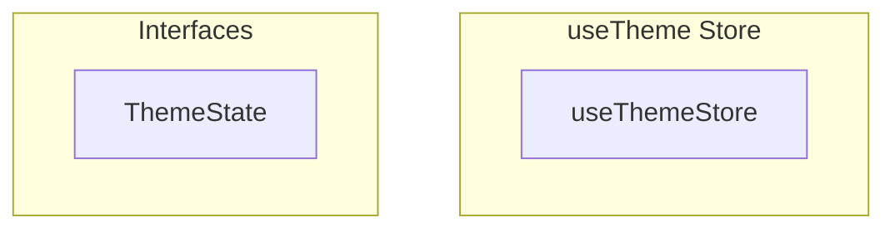

# useTheme Store

**File:** `src/stores/useTheme.ts`

## Overview




## Exports

- **useThemeStore** - const export


## Interfaces

### ThemeState

No description available.

```typescript
interface ThemeState {

  // Audio themes
  audioThemes: AudioTheme[]
  currentAudioTheme: string
  audioVolume: number
  
  // State management
  isInitialized: boolean
  isLoading: boolean
  isPreloading: boolean
  preloadingTheme: string | null
  
  // Error handling
  lastError: string | null
  
  // Visual themes (future expansion)
  // visualTheme: string
  // customColors: Record<string, string>

}
```


## Source Code Insights

**File Size:** 9425 characters
**Lines of Code:** 358
**Imports:** 4

## Usage Example

```typescript
import { useThemeStore } from '@/stores/useTheme'

// Example usage
// Use the exported functionality
```

---

*This documentation was automatically generated from the source code.*