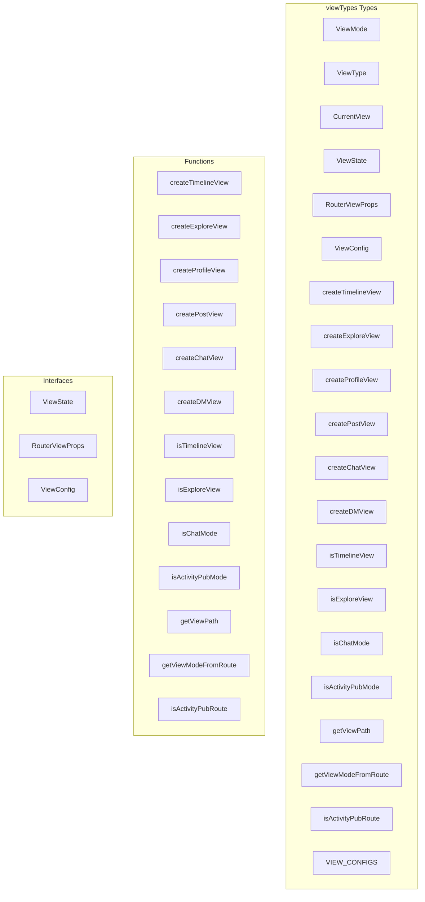

# viewTypes Types

**File:** `src/types/viewTypes.ts`

## Overview




## Exports

- **ViewMode** - enum export
- **ViewType** - enum export
- **CurrentView** - enum export
- **ViewState** - interface export
- **RouterViewProps** - interface export
- **ViewConfig** - interface export
- **createTimelineView** - const export
- **createExploreView** - const export
- **createProfileView** - const export
- **createPostView** - const export
- **createChatView** - const export
- **createDMView** - const export
- **isTimelineView** - const export
- **isExploreView** - const export
- **isChatMode** - const export
- **isActivityPubMode** - const export
- **getViewPath** - const export
- **getViewModeFromRoute** - const export
- **isActivityPubRoute** - const export
- **VIEW_CONFIGS** - const export

## Functions

### `createTimelineView(timeline: CurrentView.HOME | CurrentView.LOCAL | CurrentView.PUBLIC)`

No description available.

**Parameters:**
- `timeline: CurrentView.HOME | CurrentView.LOCAL | CurrentView.PUBLIC`

**Returns:** `ViewState`

```typescript
/**
 * Professional View State Management Types
 * Centralized type definitions for clean architecture
 */

// Core Mode Enumeration
export enum ViewMode {
  CHAT = 'chat',
  ACTIVITYPUB = 'activitypub'
}

// View Type Enumeration - Defines the general category of view
export enum ViewType {
  TIMELINE = 'timeline',      // Timeline feeds (home, local, public)
  EXPLORE = 'explore',        // Explore content (trending, instances)
  PROFILE = 'profile',        // User profile view
  POST = 'post',             // Single post detail view
  HASHTAG = 'hashtag',       // Hashtag posts view
  BOOKMARKS = 'bookmarks',   // User bookmarks
  NOTIFICATIONS = 'notifications', // User notifications
  LISTS = 'lists',           // User lists
  DM = 'dm',                 // Direct messages
  CHAT = 'chat'              // Server chat channels
}

// Current View Enumeration - Defines the specific view within a type
export enum CurrentView {
  // Timeline views
  HOME = 'home',
  LOCAL = 'local', 
  PUBLIC = 'public',
  
  // Explore views
  TRENDING = 'trending',
  INSTANCES = 'instances',
  
  // Generic views
  PROFILE = 'profile',
  POST = 'post',
  HASHTAG = 'hashtag',
  BOOKMARKS = 'bookmarks',
  NOTIFICATIONS = 'notifications',
  LISTS = 'lists',
  DM = 'dm',
  CHAT = 'chat'
}

// View State Interface - Complete view state representation
export interface ViewState {
  mode: ViewMode;
  viewType: ViewType;
  currentView: CurrentView;
  
  // Optional contextual data
  serverId?: string;
  channelId?: string;
  conversationId?: string;
  profileHandle?: string;
  postId?: string;
  isDM?: boolean;
}

// Router Props Interface - Props passed from router to components
export interface RouterViewProps {
  mode: ViewMode;
  viewType?: ViewType;
  currentView?: CurrentView;
  timeline?: string; // Legacy support
  
  // Context-specific props
  serverId?: string;
  channelId?: string;
  conversationId?: string;
  profileHandle?: string;
  postId?: string;
  isDM?: boolean;
}

// View Configuration Interface - Defines view capabilities and metadata
export interface ViewConfig {
  mode: ViewMode;
  viewType: ViewType;
  currentView: CurrentView;
  
  // Metadata
  title: string;
  icon: string;
  path: string;
  requiresAuth: boolean;
  
  // Capabilities
  hasTimeline?: boolean;
  hasComposer?: boolean;
  hasSearch?: boolean;
  hasProfile?: boolean;
}

/**
 * View State Factory Functions
 * Clean constructors for common view states
 */

export const createTimelineView = (timeline: CurrentView.HOME | CurrentView.LOCAL | CurrentView.PUBLIC): ViewState =>
```

### `createExploreView(explore: CurrentView.TRENDING | CurrentView.INSTANCES)`

No description available.

**Parameters:**
- `explore: CurrentView.TRENDING | CurrentView.INSTANCES`

**Returns:** `ViewState`

```typescript
export const createExploreView = (explore: CurrentView.TRENDING | CurrentView.INSTANCES): ViewState =>
```

### `createProfileView(profileHandle: string)`

No description available.

**Parameters:**
- `profileHandle: string`

**Returns:** `ViewState`

```typescript
export const createProfileView = (profileHandle: string): ViewState =>
```

### `createPostView(postId: string)`

No description available.

**Parameters:**
- `postId: string`

**Returns:** `ViewState`

```typescript
export const createPostView = (postId: string): ViewState =>
```

### `createChatView(serverId?: string, channelId?: string)`

No description available.

**Parameters:**
- `serverId?: string`
- `channelId?: string`

**Returns:** `ViewState`

```typescript
export const createChatView = (serverId?: string, channelId?: string): ViewState =>
```

### `createDMView(conversationId?: string)`

No description available.

**Parameters:**
- `conversationId?: string`

**Returns:** `ViewState`

```typescript
export const createDMView = (conversationId?: string): ViewState =>
```

### `isTimelineView(state: ViewState)`

No description available.

**Parameters:**
- `state: ViewState`

**Returns:** `boolean`

```typescript
/**
 * View State Utilities
 * Helper functions for working with view states
 */

export const isTimelineView = (state: ViewState): boolean =>
```

### `isExploreView(state: ViewState)`

No description available.

**Parameters:**
- `state: ViewState`

**Returns:** `boolean`

```typescript
export const isExploreView = (state: ViewState): boolean =>
```

### `isChatMode(state: ViewState)`

No description available.

**Parameters:**
- `state: ViewState`

**Returns:** `boolean`

```typescript
export const isChatMode = (state: ViewState): boolean =>
```

### `isActivityPubMode(state: ViewState)`

No description available.

**Parameters:**
- `state: ViewState`

**Returns:** `boolean`

```typescript
export const isActivityPubMode = (state: ViewState): boolean =>
```

### `getViewPath(state: ViewState)`

No description available.

**Parameters:**
- `state: ViewState`

**Returns:** `string`

```typescript
export const getViewPath = (state: ViewState): string =>
```

### `getViewModeFromRoute(routeName: string | null | undefined)`

No description available.

**Parameters:**
- `routeName: string | null | undefined`

**Returns:** `ViewMode`

```typescript
/**
 * Route Utilities
 * Helper functions for working with routes and view modes
 */

export const getViewModeFromRoute = (routeName: string | null | undefined): ViewMode =>
```

### `isActivityPubRoute(routeName: string | null | undefined)`

No description available.

**Parameters:**
- `routeName: string | null | undefined`

**Returns:** `boolean`

```typescript
export const isActivityPubRoute = (routeName: string | null | undefined): boolean =>
```


## Interfaces

### ViewState

No description available.

```typescript
interface ViewState {

  mode: ViewMode;
  viewType: ViewType;
  currentView: CurrentView;
  
  // Optional contextual data
  serverId?: string;
  channelId?: string;
  conversationId?: string;
  profileHandle?: string;
  postId?: string;
  isDM?: boolean;

}
```

### RouterViewProps

No description available.

```typescript
interface RouterViewProps {

  mode: ViewMode;
  viewType?: ViewType;
  currentView?: CurrentView;
  timeline?: string; // Legacy support
  
  // Context-specific props
  serverId?: string;
  channelId?: string;
  conversationId?: string;
  profileHandle?: string;
  postId?: string;
  isDM?: boolean;

}
```

### ViewConfig

No description available.

```typescript
interface ViewConfig {

  mode: ViewMode;
  viewType: ViewType;
  currentView: CurrentView;
  
  // Metadata
  title: string;
  icon: string;
  path: string;
  requiresAuth: boolean;
  
  // Capabilities
  hasTimeline?: boolean;
  hasComposer?: boolean;
  hasSearch?: boolean;
  hasProfile?: boolean;

}
```


## Constants

### VIEW_CONFIGS

No description available.

```typescript
export const VIEW_CONFIGS: Record<string, ViewConfig> = {
```


## Source Code Insights

**File Size:** 7373 characters
**Lines of Code:** 276
**Imports:** 0

## Usage Example

```typescript
import { ViewMode, ViewType, CurrentView, ViewState, RouterViewProps, ViewConfig, createTimelineView, createExploreView, createProfileView, createPostView, createChatView, createDMView, isTimelineView, isExploreView, isChatMode, isActivityPubMode, getViewPath, getViewModeFromRoute, isActivityPubRoute, VIEW_CONFIGS } from '@/types/viewTypes'

// Example usage
createTimelineView()
```

---

*This documentation was automatically generated from the source code.*