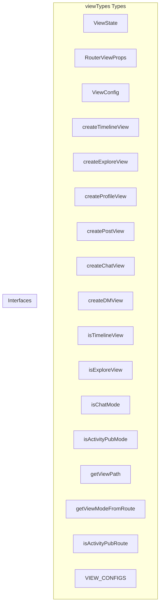

# viewTypes Types

**File:** `src/types/viewTypes.ts`

## Overview


```mermaid
graph TB
    subgraph "viewTypes Types"
        VIEWSTATE[ViewState]
        ROUTERVIEWPROPS[RouterViewProps]
        VIEWCONFIG[ViewConfig]
        CREATETIMELINEVIEW[createTimelineView]
        CREATEEXPLOREVIEW[createExploreView]
        CREATEPROFILEVIEW[createProfileView]
        CREATEPOSTVIEW[createPostView]
        CREATECHATVIEW[createChatView]
        CREATEDMVIEW[createDMView]
        ISTIMELINEVIEW[isTimelineView]
        ISEXPLOREVIEW[isExploreView]
        ISCHATMODE[isChatMode]
        ISACTIVITYPUBMODE[isActivityPubMode]
        GETVIEWPATH[getViewPath]
        GETVIEWMODEFROMROUTE[getViewModeFromRoute]
        ISACTIVITYPUBROUTE[isActivityPubRoute]
        VIEW_CONFIGS[VIEW_CONFIGS]
    end
    
    
    
    subgraph "Interfaces"
        VIEWSTATE[ViewState]
        ROUTERVIEWPROPS[RouterViewProps]
        VIEWCONFIG[ViewConfig]
    end
```

## Exports

- **ViewState** - No description
- **RouterViewProps** - No description
- **ViewConfig** - No description
- **createTimelineView** - No description
- **createExploreView** - No description
- **createProfileView** - No description
- **createPostView** - No description
- **createChatView** - No description
- **createDMView** - No description
- **isTimelineView** - No description
- **isExploreView** - No description
- **isChatMode** - No description
- **isActivityPubMode** - No description
- **getViewPath** - No description
- **getViewModeFromRoute** - No description
- **isActivityPubRoute** - No description
- **VIEW_CONFIGS** - No description


## Interfaces

### ViewState

No description available.

```typescript
export interface ViewState {
  mode: ViewMode;
  viewType: ViewType;
  currentView: CurrentView;
  
  // Optional contextual data
  serverId?: string;
  channelId?: string;
  conversationId?: string;
  profileHandle?: string;
  postId?: string;
  isDM?: boolean;
}
```

### RouterViewProps

No description available.

```typescript
export interface RouterViewProps {
  mode: ViewMode;
  viewType?: ViewType;
  currentView?: CurrentView;
  timeline?: string; // Legacy support
  
  // Context-specific props
  serverId?: string;
  channelId?: string;
  conversationId?: string;
  profileHandle?: string;
  postId?: string;
  isDM?: boolean;
}
```

### ViewConfig

No description available.

```typescript
export interface ViewConfig {
  mode: ViewMode;
  viewType: ViewType;
  currentView: CurrentView;
  
  // Metadata
  title: string;
  icon: string;
  path: string;
  requiresAuth: boolean;
  
  // Capabilities
  hasTimeline?: boolean;
  hasComposer?: boolean;
  hasSearch?: boolean;
  hasProfile?: boolean;
}
```


## Source Code Insights

**File Size:** 7287 characters
**Lines of Code:** 274
**Imports:** 0

## Usage Example

```typescript
import { ViewState, RouterViewProps, ViewConfig, createTimelineView, createExploreView, createProfileView, createPostView, createChatView, createDMView, isTimelineView, isExploreView, isChatMode, isActivityPubMode, getViewPath, getViewModeFromRoute, isActivityPubRoute, VIEW_CONFIGS } from '@/types/viewTypes.ts'

// Example usage
// Use the exported functionality
```

---

*This documentation was automatically generated from the source code.*