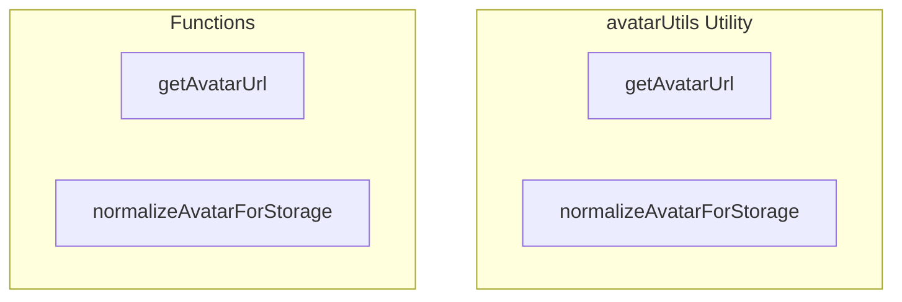

# avatarUtils Utility

**File:** `src/utils/avatarUtils.ts`

## Overview




## Exports

- **getAvatarUrl** - function export
- **normalizeAvatarForStorage** - function export

## Functions

### `getAvatarUrl(avatarUrl: string | null | undefined, size: number = 256)`

No description available.

**Parameters:**
- `avatarUrl: string | null | undefined`
- `size: number = 256`

**Returns:** `string`

```typescript
/**
 * Normalizes avatar URL to ensure consistent display across the application
 * Handles both full URLs and path-only formats
 * Always returns the proper public URL for Supabase storage paths with optimization
 */
export function getAvatarUrl(avatarUrl: string | null | undefined, size: number = 256): string
```

### `normalizeAvatarForStorage(avatarUrl: string | null | undefined)`

No description available.

**Parameters:**
- `avatarUrl: string | null | undefined`

**Returns:** `string | null`

```typescript
/**
 * Normalizes avatar URL for storage - ensures we store paths, not full URLs
 * This should be used before saving avatar URLs to the database
 */
export function normalizeAvatarForStorage(avatarUrl: string | null | undefined): string | null
```


## Source Code Insights

**File Size:** 3740 characters
**Lines of Code:** 93
**Imports:** 1

## Usage Example

```typescript
import { getAvatarUrl, normalizeAvatarForStorage } from '@/utils/avatarUtils'

// Example usage
getAvatarUrl()
```

---

*This documentation was automatically generated from the source code.*