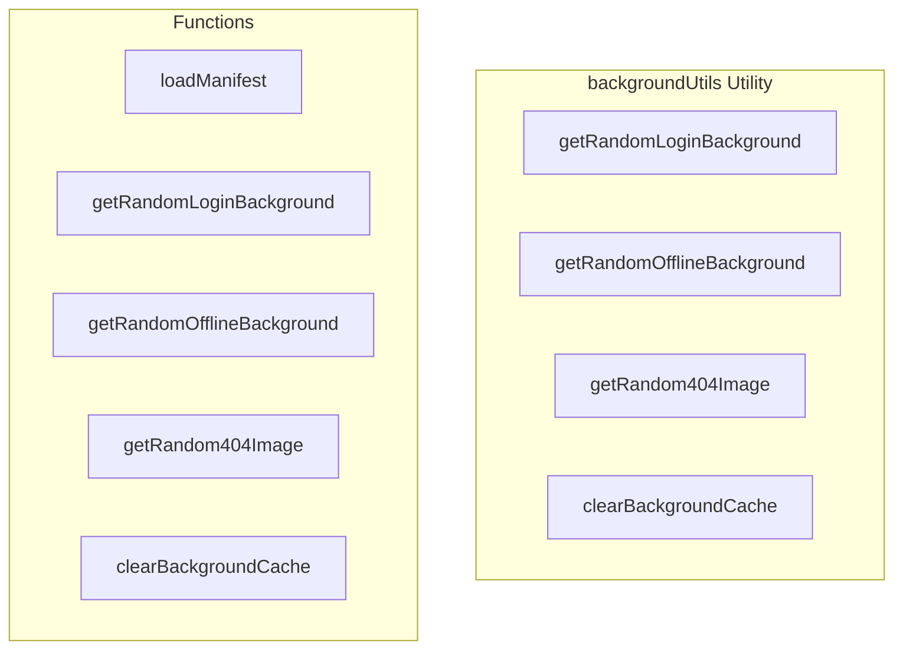

# backgroundUtils Utility

**File:** `src/utils/backgroundUtils.ts`

## Overview




## Exports

- **getRandomLoginBackground** - function export
- **getRandomOfflineBackground** - function export
- **getRandom404Image** - function export
- **clearBackgroundCache** - function export

## Functions

### `loadManifest()`

No description available.

**Parameters:**
None

**Returns:** `Promise&lt;`

```typescript
/**
 * Utility functions for discovering and selecting background images
 * Supports organized folders: /backgrounds/login/ and /backgrounds/offline/
 * Falls back to legacy /img/ pattern if new folders don't exist
 * 
 * Uses a manifest file (generated at build time) for efficient discovery.
 * Falls back to minimal runtime discovery if manifest doesn't exist.
 */

// Cache for manifest
let manifestCache: { login: string[]; offline: string[]; notFound: string[] } | null = null
let manifestLoadAttempted = false

/**
 * Loads the background manifest file if it exists
 * This is generated at build time by scripts/build-background-manifest.mjs
 */
async function loadManifest(): Promise<
```

### `getRandomLoginBackground()`

No description available.

**Parameters:**
None

**Returns:** `Promise&lt;string&gt;`

```typescript
/**
 * Gets a random background image for login/register pages
 * Uses manifest if available, falls back to legacy /img/login_bg*.webp pattern
 */
export async function getRandomLoginBackground(): Promise<string>
```

### `getRandomOfflineBackground()`

No description available.

**Parameters:**
None

**Returns:** `Promise&lt;string&gt;`

```typescript
/**
 * Gets a random background image for offline pages
 * Uses manifest if available, falls back to legacy /img/offline_bg*.webp pattern
 */
export async function getRandomOfflineBackground(): Promise<string>
```

### `getRandom404Image()`

No description available.

**Parameters:**
None

**Returns:** `Promise&lt;string&gt;`

```typescript
/**
 * Gets a random 404 image
 * Uses manifest if available, falls back to legacy /404*.webp pattern
 */
export async function getRandom404Image(): Promise<string>
```

### `clearBackgroundCache()`

No description available.

**Parameters:**
None

**Returns:** `void`

```typescript
/**
 * Clears the manifest cache (useful for development/testing)
 */
export function clearBackgroundCache(): void
```


## Source Code Insights

**File Size:** 3414 characters
**Lines of Code:** 111
**Imports:** 0

## Usage Example

```typescript
import { getRandomLoginBackground, getRandomOfflineBackground, getRandom404Image, clearBackgroundCache } from '@/utils/backgroundUtils'

// Example usage
loadManifest()
```

---

*This documentation was automatically generated from the source code.*