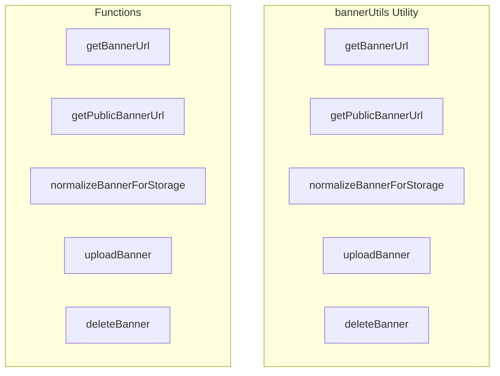

# bannerUtils Utility

**File:** `src/utils/bannerUtils.ts`

## Overview




## Exports

- **getBannerUrl** - function export
- **getPublicBannerUrl** - function export
- **normalizeBannerForStorage** - function export
- **uploadBanner** - function export
- **deleteBanner** - function export

## Functions

### `getBannerUrl(bannerUrl?: string | null, options?: { width?: number; height?: number; quality?: number })`

No description available.

**Parameters:**
- `bannerUrl?: string | null`
- `options?: { width?: number; height?: number; quality?: number }`

**Returns:** `string | null`

```typescript
/**
 * Get banner URL for a user
 * Returns a public URL for banner stored in Supabase storage, or fallback to external URL
 */
export function getBannerUrl(bannerUrl?: string | null, options?: { width?: number; height?: number; quality?: number }): string | null
```

### `getPublicBannerUrl(storagePath: string, options?: { width?: number; height?: number; quality?: number })`

No description available.

**Parameters:**
- `storagePath: string`
- `options?: { width?: number; height?: number; quality?: number }`

**Returns:** `string | null`

```typescript
/**
 * Get public banner URL from storage path with optional Supabase transform optimization
 */
export function getPublicBannerUrl(storagePath: string, options?: { width?: number; height?: number; quality?: number }): string | null
```

### `normalizeBannerForStorage(bannerUrl?: string | null)`

No description available.

**Parameters:**
- `bannerUrl?: string | null`

**Returns:** `string | null`

```typescript
/**
 * Normalize banner URL for storage
 * Converts signed URLs back to storage paths for database storage
 */
export function normalizeBannerForStorage(bannerUrl?: string | null): string | null
```

### `uploadBanner(file: File, userId: string)`

No description available.

**Parameters:**
- `file: File`
- `userId: string`

**Returns:** `Promise&lt;`

```typescript
/**
 * Upload banner file to storage
 */
export async function uploadBanner(file: File, userId: string): Promise<
```

### `deleteBanner(storagePath: string)`

No description available.

**Parameters:**
- `storagePath: string`

**Returns:** `Promise&lt;`

```typescript
/**
 * Delete banner from storage
 */
export async function deleteBanner(storagePath: string): Promise<
```


## Source Code Insights

**File Size:** 3320 characters
**Lines of Code:** 116
**Imports:** 2

## Usage Example

```typescript
import { getBannerUrl, getPublicBannerUrl, normalizeBannerForStorage, uploadBanner, deleteBanner } from '@/utils/bannerUtils'

// Example usage
getBannerUrl()
```

---

*This documentation was automatically generated from the source code.*