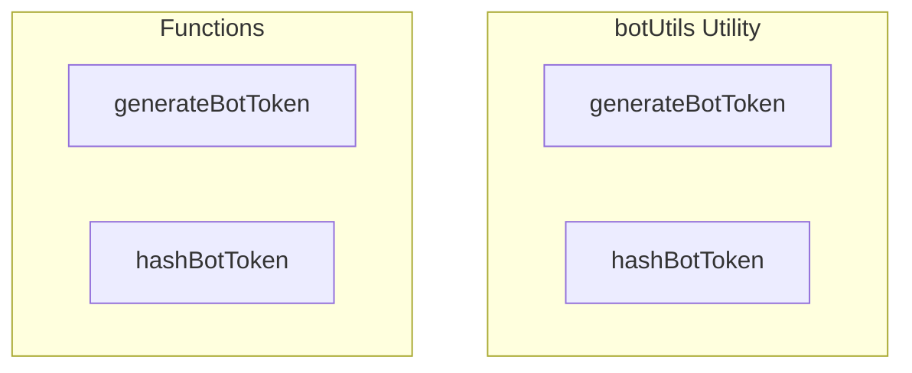

# botUtils Utility

**File:** `src/utils/botUtils.ts`

## Overview




## Exports

- **generateBotToken** - function export
- **hashBotToken** - function export

## Functions

### `generateBotToken(prefix = 'harmony_bot_')`

No description available.

**Parameters:**
- `prefix = 'harmony_bot_'`

**Returns:** `string`

```typescript
/**
 * Generate a secure bot token
 */
export function generateBotToken(prefix = 'harmony_bot_'): string
```

### `hashBotToken(token: string)`

No description available.

**Parameters:**
- `token: string`

**Returns:** `Promise&lt;string&gt;`

```typescript
/**
 * Hash a bot token (client-side fallback - server should hash with bcrypt in production)
 */
export async function hashBotToken(token: string): Promise<string>
```


## Source Code Insights

**File Size:** 750 characters
**Lines of Code:** 22
**Imports:** 0

## Usage Example

```typescript
import { generateBotToken, hashBotToken } from '@/utils/botUtils'

// Example usage
generateBotToken()
```

---

*This documentation was automatically generated from the source code.*