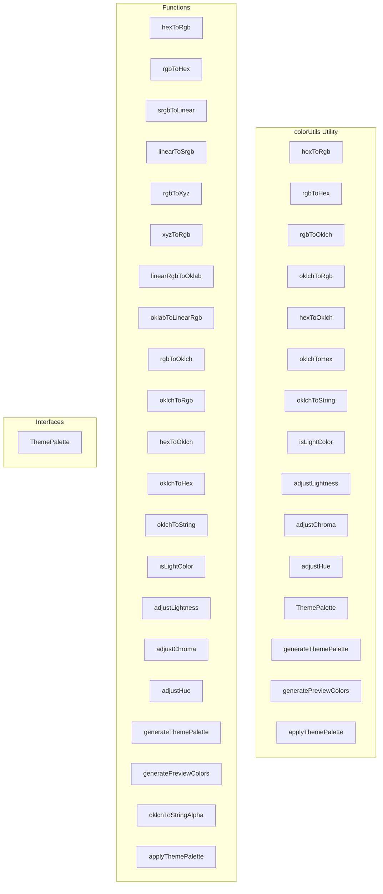

# colorUtils Utility

**File:** `src/utils/colorUtils.ts`

## Overview




## Exports

- **hexToRgb** - function export
- **rgbToHex** - function export
- **rgbToOklch** - function export
- **oklchToRgb** - function export
- **hexToOklch** - function export
- **oklchToHex** - function export
- **oklchToString** - function export
- **isLightColor** - function export
- **adjustLightness** - function export
- **adjustChroma** - function export
- **adjustHue** - function export
- **ThemePalette** - interface export
- **generateThemePalette** - function export
- **generatePreviewColors** - function export
- **applyThemePalette** - function export

## Functions

### `hexToRgb(hex: string)`

No description available.

**Parameters:**
- `hex: string`

**Returns:** `void`

```typescript
/**
 * Color Utilities for OKLCH-based Theme System
 * 
 * Provides utilities for converting between color spaces and generating
 * theme palettes using the perceptually uniform OKLCH color space.
 */
import { debug } from '@/utils/debug'
/**
 * Convert HEX color to RGB
 */
export function hexToRgb(hex: string):
```

### `rgbToHex(r: number, g: number, b: number)`

No description available.

**Parameters:**
- `r: number`
- `g: number`
- `b: number`

**Returns:** `string`

```typescript
/**
 * Convert RGB to HEX
 */
export function rgbToHex(r: number, g: number, b: number): string
```

### `srgbToLinear(c: number)`

No description available.

**Parameters:**
- `c: number`

**Returns:** `number`

```typescript
/**
 * Convert sRGB to linear RGB
 */
function srgbToLinear(c: number): number
```

### `linearToSrgb(c: number)`

No description available.

**Parameters:**
- `c: number`

**Returns:** `number`

```typescript
/**
 * Convert linear RGB to sRGB
 */
function linearToSrgb(c: number): number
```

### `rgbToXyz(r: number, g: number, b: number)`

No description available.

**Parameters:**
- `r: number`
- `g: number`
- `b: number`

**Returns:** `void`

```typescript
/**
 * Convert RGB to XYZ (D65 illuminant)
 */
function rgbToXyz(r: number, g: number, b: number):
```

### `xyzToRgb(x: number, y: number, z: number)`

No description available.

**Parameters:**
- `x: number`
- `y: number`
- `z: number`

**Returns:** `void`

```typescript
/**
 * Convert XYZ to RGB
 */
function xyzToRgb(x: number, y: number, z: number):
```

### `linearRgbToOklab(r: number, g: number, b: number)`

No description available.

**Parameters:**
- `r: number`
- `g: number`
- `b: number`

**Returns:** `void`

```typescript
/**
 * Convert Linear RGB to OKLab
 */
function linearRgbToOklab(r: number, g: number, b: number):
```

### `oklabToLinearRgb(l: number, a: number, b: number)`

No description available.

**Parameters:**
- `l: number`
- `a: number`
- `b: number`

**Returns:** `void`

```typescript
/**
 * Convert OKLab to Linear RGB
 */
function oklabToLinearRgb(l: number, a: number, b: number):
```

### `rgbToOklch(r: number, g: number, b: number)`

No description available.

**Parameters:**
- `r: number`
- `g: number`
- `b: number`

**Returns:** `void`

```typescript
/**
 * Convert RGB to OKLCH (correct implementation)
 */
export function rgbToOklch(r: number, g: number, b: number):
```

### `oklchToRgb(l: number, c: number, h: number)`

No description available.

**Parameters:**
- `l: number`
- `c: number`
- `h: number`

**Returns:** `void`

```typescript
/**
 * Convert OKLCH to RGB (correct implementation)
 */
export function oklchToRgb(l: number, c: number, h: number):
```

### `hexToOklch(hex: string)`

No description available.

**Parameters:**
- `hex: string`

**Returns:** `void`

```typescript
/**
 * Convert HEX to OKLCH
 */
export function hexToOklch(hex: string):
```

### `oklchToHex(l: number, c: number, h: number)`

No description available.

**Parameters:**
- `l: number`
- `c: number`
- `h: number`

**Returns:** `string`

```typescript
/**
 * Convert OKLCH to HEX
 */
export function oklchToHex(l: number, c: number, h: number): string
```

### `oklchToString(l: number, c: number, h: number)`

No description available.

**Parameters:**
- `l: number`
- `c: number`
- `h: number`

**Returns:** `string`

```typescript
/**
 * Format OKLCH as CSS string
 */
export function oklchToString(l: number, c: number, h: number): string
```

### `isLightColor(hex: string)`

No description available.

**Parameters:**
- `hex: string`

**Returns:** `boolean`

```typescript
/**
 * Determine if a color is light or dark based on lightness
 */
export function isLightColor(hex: string): boolean
```

### `adjustLightness(hex: string, delta: number)`

No description available.

**Parameters:**
- `hex: string`
- `delta: number`

**Returns:** `string`

```typescript
/**
 * Adjust lightness of a color
 */
export function adjustLightness(hex: string, delta: number): string
```

### `adjustChroma(hex: string, delta: number)`

No description available.

**Parameters:**
- `hex: string`
- `delta: number`

**Returns:** `string`

```typescript
/**
 * Adjust chroma (saturation) of a color
 */
export function adjustChroma(hex: string, delta: number): string
```

### `adjustHue(hex: string, delta: number)`

No description available.

**Parameters:**
- `hex: string`
- `delta: number`

**Returns:** `string`

```typescript
/**
 * Adjust hue of a color
 */
export function adjustHue(hex: string, delta: number): string
```

### `generateThemePalette(accentHex: string, forcedMode?: 'light' | 'dark', backgroundHex?: string, lightnessOffset: number = 0, primaryHex?: string, chromaOffset: number = 0)`

No description available.

**Parameters:**
- `accentHex: string`
- `forcedMode?: 'light' | 'dark'`
- `backgroundHex?: string`
- `lightnessOffset: number = 0`
- `primaryHex?: string`
- `chromaOffset: number = 0`

**Returns:** `ThemePalette`

```typescript
/**
 * Generate a complete theme palette from an accent color
 */
export interface ThemePalette {
  // Primary colors
  primary: string
  primaryHover: string
  primaryLight: string
  primaryDark: string
  
  // Background colors
  bgPrimary: string
  bgSecondary: string
  bgTertiary: string
  bgChat: string
  bgSidebar: string
  
  // Text colors
  textPrimary: string
  textSecondary: string
  textTertiary: string
  
  // Border colors
  borderPrimary: string
  borderSecondary: string
  
  // Metadata
  isLightTheme: boolean
}

/**
 * Generate theme palette from primary color, accent color, and background settings
 */
export function generateThemePalette(
  accentHex: string, 
  forcedMode?: 'light' | 'dark',
  backgroundHex?: string,
  lightnessOffset: number = 0,
  primaryHex?: string,
  chromaOffset: number = 0
): ThemePalette
```

### `generatePreviewColors(backgroundHex: string, mode: 'light' | 'dark', lightnessOffset: number = 0, chromaOffset: number = 0)`

No description available.

**Parameters:**
- `backgroundHex: string`
- `mode: 'light' | 'dark'`
- `lightnessOffset: number = 0`
- `chromaOffset: number = 0`

**Returns:** `void`

```typescript
/**
 * Generate preview colors for theme card based on background settings
 */
export function generatePreviewColors(
  backgroundHex: string,
  mode: 'light' | 'dark',
  lightnessOffset: number = 0,
  chromaOffset: number = 0
):
```

### `oklchToStringAlpha(l: number, c: number, h: number, alpha: number)`

No description available.

**Parameters:**
- `l: number`
- `c: number`
- `h: number`
- `alpha: number`

**Returns:** `string`

```typescript
/**
 * Format OKLCH as CSS string with alpha
 */
function oklchToStringAlpha(l: number, c: number, h: number, alpha: number): string
```

### `applyThemePalette(palette: ThemePalette)`

No description available.

**Parameters:**
- `palette: ThemePalette`

**Returns:** `void`

```typescript
/**
 * Apply theme palette to CSS custom properties using OKLCH
 */
export function applyThemePalette(palette: ThemePalette): void
```


## Interfaces

### ThemePalette

No description available.

```typescript
interface ThemePalette {

  // Primary colors
  primary: string
  primaryHover: string
  primaryLight: string
  primaryDark: string
  
  // Background colors
  bgPrimary: string
  bgSecondary: string
  bgTertiary: string
  bgChat: string
  bgSidebar: string
  
  // Text colors
  textPrimary: string
  textSecondary: string
  textTertiary: string
  
  // Border colors
  borderPrimary: string
  borderSecondary: string
  
  // Metadata
  isLightTheme: boolean

}
```


## Source Code Insights

**File Size:** 21162 characters
**Lines of Code:** 563
**Imports:** 1

## Usage Example

```typescript
import { hexToRgb, rgbToHex, rgbToOklch, oklchToRgb, hexToOklch, oklchToHex, oklchToString, isLightColor, adjustLightness, adjustChroma, adjustHue, ThemePalette, generateThemePalette, generatePreviewColors, applyThemePalette } from '@/utils/colorUtils'

// Example usage
hexToRgb()
```

---

*This documentation was automatically generated from the source code.*