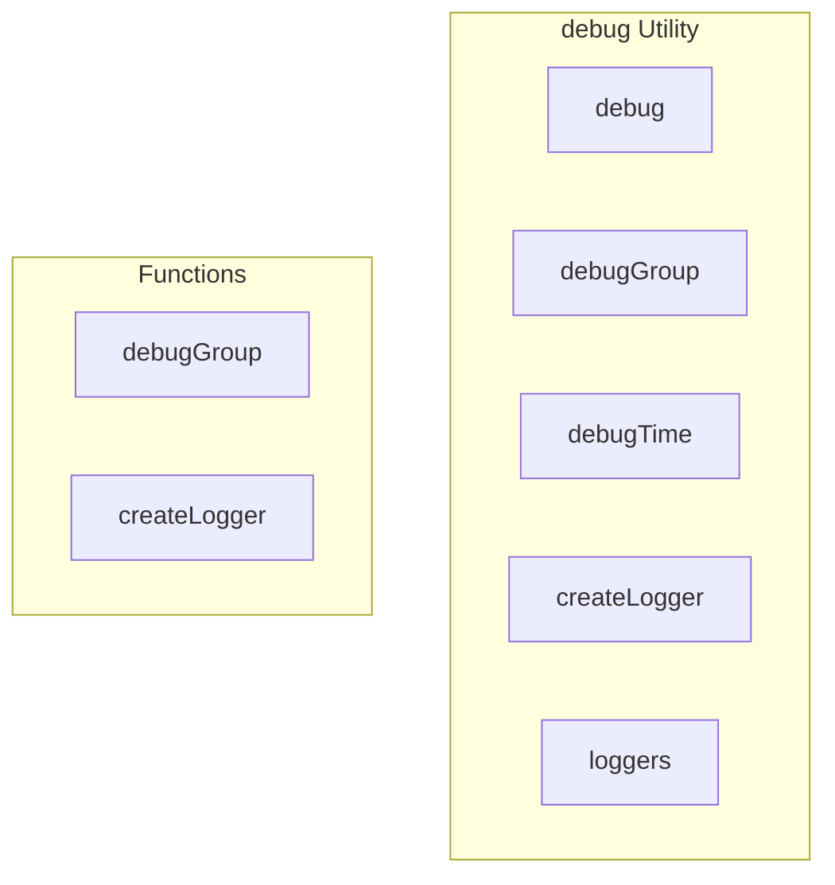

# debug Utility

**File:** `src/utils/debug.ts`

## Overview




## Exports

- **debug** - const export
- **debugGroup** - const export
- **debugTime** - const export
- **createLogger** - const export
- **loggers** - const export

## Functions

### `debugGroup(label: string, fn: ()`

No description available.

**Parameters:**
- `label: string`
- `fn: (`

**Returns:** `Unknown`

```typescript
/**
 * Debug Utility - Environment-aware logging for Harmony
 * 
 * Only logs when:
 * 1. Running in development mode (import.meta.env.DEV)
 * 2. VITE_DEBUG_LOGGING is explicitly set to 'true'
 * 
 * Usage:
 * import { debug, debugGroup, debugTime } from '@/utils/debug'
 * debug.log('Message', data)
 * debug.warn('Warning message')
 * debug.error('Error message') // Always logs in dev, errors are important
 */

// Check if debug logging is enabled
const isDebugEnabled = (): boolean => {
  // In production, never log debug messages
  // if (!import.meta.env.DEV) return false
  // In dev, check if debug logging is explicitly enabled
  return import.meta.env.VITE_DEBUG_LOGGING === 'true'
}

// Cache the result at module load time for performance
const DEBUG_ENABLED = isDebugEnabled()

// Error logging is always enabled in development
const ERROR_LOGGING_ENABLED = import.meta.env.DEV

/**
 * Main debug object - provides console methods that only execute in debug mode
 */
export const debug = {
  /**
   * Log a debug message (only in debug mode)
   */
  log: (...args: any[]): void => {
    if (DEBUG_ENABLED) {
      console.log(...args)
    }
  },

  /**
   * Log a warning (only in debug mode)
   */
  warn: (...args: any[]): void => {
    if (DEBUG_ENABLED) {
      console.warn(...args)
    }
  },

  /**
   * Log an error (always in development, errors are important)
   */
  error: (...args: any[]): void => {
    if (ERROR_LOGGING_ENABLED) {
      console.error(...args)
    }
  },

  /**
   * Log info (only in debug mode)
   */
  info: (...args: any[]): void => {
    if (DEBUG_ENABLED) {
      console.info(...args)
    }
  },

  /**
   * Log debug (only in debug mode)
   */
  debug: (...args: any[]): void => {
    if (DEBUG_ENABLED) {
      console.debug(...args)
    }
  },

  /**
   * Log a table (only in debug mode)
   */
  table: (data: any, columns?: string[]): void => {
    if (DEBUG_ENABLED) {
      console.table(data, columns)
    }
  },

  /**
   * Assert a condition (only in debug mode)
   */
  assert: (condition: boolean, ...args: any[]): void => {
    if (DEBUG_ENABLED) {
      console.assert(condition, ...args)
    }
  },

  /**
   * Log with a specific category prefix
   */
  category: (category: string) => ({
    log: (...args: any[]) => debug.log(`[${category}]`, ...args),
    warn: (...args: any[]) => debug.warn(`[${category}]`, ...args),
    error: (...args: any[]) => debug.error(`[${category}]`, ...args),
    info: (...args: any[]) => debug.info(`[${category}]`, ...args),
  }),
}

/**
 * Create a console group (only in debug mode)
 */
export const debugGroup = (label: string, fn: () =>
```

### `createLogger(category: string)`

No description available.

**Parameters:**
- `category: string`

**Returns:** `Unknown`

```typescript
/**
 * Time a function execution (only in debug mode)
 */
export const debugTime = async <T>(label: string, fn: () => T | Promise<T>): Promise<T> => {
  if (DEBUG_ENABLED) {
    console.time(label)
    try {
      const result = await fn()
      console.timeEnd(label)
      return result
    } catch (error) {
      console.timeEnd(label)
      throw error
    }
  }
  return fn()
}

/**
 * Create category-specific loggers
 */
export const createLogger = (category: string) =>
```


## Constants

### DEBUG_ENABLED

No description available.

```typescript
const DEBUG_ENABLED = isDebugEnabled()
```

### ERROR_LOGGING_ENABLED

No description available.

```typescript
const ERROR_LOGGING_ENABLED = import.meta.env.DEV
```


## Source Code Insights

**File Size:** 3844 characters
**Lines of Code:** 164
**Imports:** 0

## Usage Example

```typescript
import { debug, debugGroup, debugTime, createLogger, loggers } from '@/utils/debug'

// Example usage
debugGroup()
```

---

*This documentation was automatically generated from the source code.*