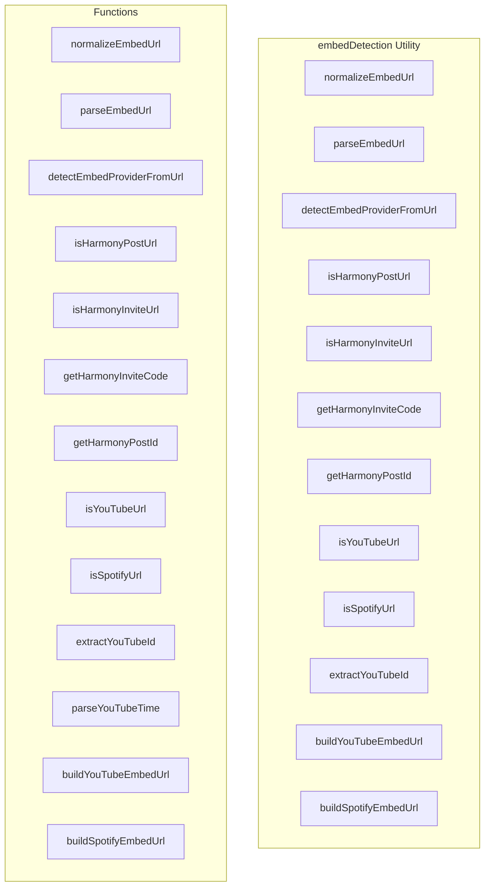

# embedDetection Utility

**File:** `src/utils/embedDetection.ts`

## Overview




## Exports

- **normalizeEmbedUrl** - function export
- **parseEmbedUrl** - function export
- **detectEmbedProviderFromUrl** - function export
- **isHarmonyPostUrl** - function export
- **isHarmonyInviteUrl** - function export
- **getHarmonyInviteCode** - function export
- **getHarmonyPostId** - function export
- **isYouTubeUrl** - function export
- **isSpotifyUrl** - function export
- **extractYouTubeId** - function export
- **buildYouTubeEmbedUrl** - function export
- **buildSpotifyEmbedUrl** - function export

## Functions

### `normalizeEmbedUrl(raw: string)`

No description available.

**Parameters:**
- `raw: string`

**Returns:** `string | null`

```typescript
export function normalizeEmbedUrl(raw: string): string | null
```

### `parseEmbedUrl(raw: string)`

No description available.

**Parameters:**
- `raw: string`

**Returns:** `URL | null`

```typescript
export function parseEmbedUrl(raw: string): URL | null
```

### `detectEmbedProviderFromUrl(input: string | URL)`

No description available.

**Parameters:**
- `input: string | URL`

**Returns:** `EmbedProvider`

```typescript
export function detectEmbedProviderFromUrl(input: string | URL): EmbedProvider
```

### `isHarmonyPostUrl(url: URL)`

No description available.

**Parameters:**
- `url: URL`

**Returns:** `boolean`

```typescript
export function isHarmonyPostUrl(url: URL): boolean
```

### `isHarmonyInviteUrl(url: URL)`

No description available.

**Parameters:**
- `url: URL`

**Returns:** `boolean`

```typescript
export function isHarmonyInviteUrl(url: URL): boolean
```

### `getHarmonyInviteCode(url: URL)`

No description available.

**Parameters:**
- `url: URL`

**Returns:** `string | null`

```typescript
export function getHarmonyInviteCode(url: URL): string | null
```

### `getHarmonyPostId(url: URL)`

No description available.

**Parameters:**
- `url: URL`

**Returns:** `string | null`

```typescript
export function getHarmonyPostId(url: URL): string | null
```

### `isYouTubeUrl(url: URL)`

No description available.

**Parameters:**
- `url: URL`

**Returns:** `boolean`

```typescript
export function isYouTubeUrl(url: URL): boolean
```

### `isSpotifyUrl(url: URL)`

No description available.

**Parameters:**
- `url: URL`

**Returns:** `boolean`

```typescript
export function isSpotifyUrl(url: URL): boolean
```

### `extractYouTubeId(url: URL)`

No description available.

**Parameters:**
- `url: URL`

**Returns:** `string | null`

```typescript
export function extractYouTubeId(url: URL): string | null
```

### `parseYouTubeTime(url: URL)`

No description available.

**Parameters:**
- `url: URL`

**Returns:** `number | null`

```typescript
/**
 * Parse YouTube time parameter to seconds.
 * Handles: ?t=90, ?t=1m30s, ?t=1h2m30s, &t=90, youtu.be/id?t=90
 */
function parseYouTubeTime(url: URL): number | null
```

### `buildYouTubeEmbedUrl(url: URL)`

No description available.

**Parameters:**
- `url: URL`

**Returns:** `string | null`

```typescript
export function buildYouTubeEmbedUrl(url: URL): string | null
```

### `buildSpotifyEmbedUrl(url: URL)`

No description available.

**Parameters:**
- `url: URL`

**Returns:** `string | null`

```typescript
export function buildSpotifyEmbedUrl(url: URL): string | null
```


## Source Code Insights

**File Size:** 4897 characters
**Lines of Code:** 167
**Imports:** 1

## Usage Example

```typescript
import { normalizeEmbedUrl, parseEmbedUrl, detectEmbedProviderFromUrl, isHarmonyPostUrl, isHarmonyInviteUrl, getHarmonyInviteCode, getHarmonyPostId, isYouTubeUrl, isSpotifyUrl, extractYouTubeId, buildYouTubeEmbedUrl, buildSpotifyEmbedUrl } from '@/utils/embedDetection'

// Example usage
normalizeEmbedUrl()
```

---

*This documentation was automatically generated from the source code.*