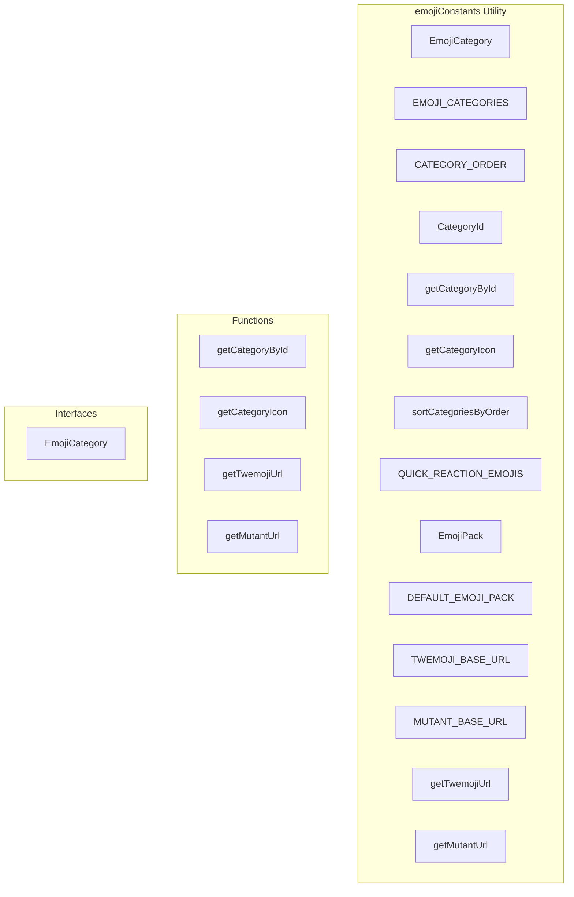

# emojiConstants Utility

**File:** `src/utils/emojiConstants.ts`

## Overview




## Exports

- **EmojiCategory** - interface export
- **EMOJI_CATEGORIES** - const export
- **CATEGORY_ORDER** - const export
- **CategoryId** - type export
- **getCategoryById** - function export
- **getCategoryIcon** - function export
- **sortCategoriesByOrder** - function export
- **QUICK_REACTION_EMOJIS** - const export
- **EmojiPack** - type export
- **DEFAULT_EMOJI_PACK** - const export
- **TWEMOJI_BASE_URL** - const export
- **MUTANT_BASE_URL** - const export
- **getTwemojiUrl** - function export
- **getMutantUrl** - function export

## Functions

### `getCategoryById(id: string)`

No description available.

**Parameters:**
- `id: string`

**Returns:** `EmojiCategory | undefined`

```typescript
/**
 * Emoji Constants
 * 
 * Single source of truth for emoji category definitions.
 * Used across all emoji pickers (Chat, DMs, ActivityPub).
 */

/**
 * Emoji category definition
 */
export interface EmojiCategory {
  id: string;
  name: string;
  icon: string;
  order: number;
}

/**
 * Standard Unicode emoji categories in display order.
 * Order matches the Unicode standard and Discord's emoji picker.
 */
export const EMOJI_CATEGORIES: EmojiCategory[] = [
  { id: 'people', name: 'People', icon: '😀', order: 0 },
  { id: 'nature', name: 'Nature', icon: '🐱', order: 1 },
  { id: 'food', name: 'Food', icon: '🍔', order: 2 },
  { id: 'activities', name: 'Activities', icon: '⚽', order: 3 },
  { id: 'travel', name: 'Travel', icon: '🚗', order: 4 },
  { id: 'objects', name: 'Objects', icon: '💡', order: 5 },
  { id: 'symbols', name: 'Symbols', icon: '❤️', order: 6 },
  { id: 'flags', name: 'Flags', icon: '🏳️', order: 7 }
] as const;

/**
 * Category order array for sorting
 */
export const CATEGORY_ORDER = ['people', 'nature', 'food', 'activities', 'travel', 'objects', 'symbols', 'flags'] as const;

/**
 * Type for valid category IDs
 */
export type CategoryId = typeof CATEGORY_ORDER[number];

/**
 * Get category by ID
 */
export function getCategoryById(id: string): EmojiCategory | undefined
```

### `getCategoryIcon(id: string)`

No description available.

**Parameters:**
- `id: string`

**Returns:** `string`

```typescript
/**
 * Get category icon by ID
 */
export function getCategoryIcon(id: string): string
```

### `getTwemojiUrl(codepoint: string)`

No description available.

**Parameters:**
- `codepoint: string`

**Returns:** `string`

```typescript
/**
 * Sort categories by their defined order
 */
export function sortCategoriesByOrder<T extends { id?: string; category?: string }>(items: T[]): T[] {
  return [...items].sort((a, b) => {
    const catA = a.id || a.category || '';
    const catB = b.id || b.category || '';
    const orderA = CATEGORY_ORDER.indexOf(catA as CategoryId);
    const orderB = CATEGORY_ORDER.indexOf(catB as CategoryId);
    return (orderA === -1 ? 99 : orderA) - (orderB === -1 ? 99 : orderB);
  });
}

/**
 * Quick reaction emojis - commonly used for reactions
 */
export const QUICK_REACTION_EMOJIS = [
  { unicode: '👍', shortcode: 'thumbs_up', name: 'thumbs up' },
  { unicode: '❤️', shortcode: 'heart', name: 'red heart' },
  { unicode: '😂', shortcode: 'joy', name: 'face with tears of joy' },
  { unicode: '😮', shortcode: 'open_mouth', name: 'face with open mouth' },
  { unicode: '😢', shortcode: 'cry', name: 'crying face' },
  { unicode: '😡', shortcode: 'rage', name: 'pouting face' },
  { unicode: '🎉', shortcode: 'tada', name: 'party popper' },
  { unicode: '🔥', shortcode: 'fire', name: 'fire' }
] as const;

/**
 * Emoji pack types
 */
export type EmojiPack = 'twemoji' | 'mutant' | 'native';

/**
 * Default emoji pack
 */
export const DEFAULT_EMOJI_PACK: EmojiPack = 'twemoji';

/**
 * Twemoji base URL for SVGs
 */
export const TWEMOJI_BASE_URL = '/assets/emojis/twemoji';

/**
 * Mutant Standard base URL for SVGs
 */
export const MUTANT_BASE_URL = '/assets/emojis/mutant_emojis_svg';

/**
 * Get Twemoji SVG URL from codepoint
 */
export function getTwemojiUrl(codepoint: string): string
```

### `getMutantUrl(svgPath: string)`

No description available.

**Parameters:**
- `svgPath: string`

**Returns:** `string`

```typescript
/**
 * Get Mutant SVG URL from path
 */
export function getMutantUrl(svgPath: string): string
```


## Interfaces

### EmojiCategory

No description available.

```typescript
interface EmojiCategory {

  id: string;
  name: string;
  icon: string;
  order: number;

}
```


## Type Definitions

### CategoryId

No description available.

```typescript
/**
 * Emoji Constants
 * 
 * Single source of truth for emoji category definitions.
 * Used across all emoji pickers (Chat, DMs, ActivityPub).
 */

/**
 * Emoji category definition
 */
export interface EmojiCategory {
  id: string;
  name: string;
  icon: string;
  order: number;
}

/**
 * Standard Unicode emoji categories in display order.
 * Order matches the Unicode standard and Discord's emoji picker.
 */
export const EMOJI_CATEGORIES: EmojiCategory[] = [
  { id: 'people', name: 'People', i...
```

### EmojiPack

No description available.

```typescript
/**
 * Get category by ID
 */
export function getCategoryById(id: string): EmojiCategory | undefined {
  return EMOJI_CATEGORIES.find(cat => cat.id === id);
}

/**
 * Get category icon by ID
 */
export function getCategoryIcon(id: string): string {
  return getCategoryById(id)?.icon ?? '📦';
}

/**
 * Sort categories by their defined order
 */
export function sortCategoriesByOrder<T extends { id?: string; category?: string }>(items: T[]): T[] {
  return [...items].sort((a, b) => {
    const catA...
```


## Constants

### EMOJI_CATEGORIES

No description available.

```typescript
export const EMOJI_CATEGORIES: EmojiCategory[] = [
```

### CATEGORY_ORDER

No description available.

```typescript
export const CATEGORY_ORDER = ['people', 'nature', 'food', 'activities', 'travel', 'objects', 'symbols', 'flags'] as const
```

### QUICK_REACTION_EMOJIS

No description available.

```typescript
export const QUICK_REACTION_EMOJIS = [
```

### DEFAULT_EMOJI_PACK

No description available.

```typescript
export const DEFAULT_EMOJI_PACK: EmojiPack = 'twemoji'
```

### TWEMOJI_BASE_URL

No description available.

```typescript
export const TWEMOJI_BASE_URL = '/assets/emojis/twemoji'
```

### MUTANT_BASE_URL

No description available.

```typescript
export const MUTANT_BASE_URL = '/assets/emojis/mutant_emojis_svg'
```


## Source Code Insights

**File Size:** 3296 characters
**Lines of Code:** 118
**Imports:** 0

## Usage Example

```typescript
import { EmojiCategory, EMOJI_CATEGORIES, CATEGORY_ORDER, CategoryId, getCategoryById, getCategoryIcon, sortCategoriesByOrder, QUICK_REACTION_EMOJIS, EmojiPack, DEFAULT_EMOJI_PACK, TWEMOJI_BASE_URL, MUTANT_BASE_URL, getTwemojiUrl, getMutantUrl } from '@/utils/emojiConstants'

// Example usage
getCategoryById()
```

---

*This documentation was automatically generated from the source code.*