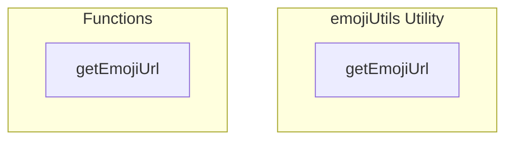

# emojiUtils Utility

**File:** `src/utils/emojiUtils.ts`

## Overview




## Exports

- **getEmojiUrl** - function export

## Functions

### `getEmojiUrl(emojiUrl: string | null | undefined, size: number = 48)`

Builds a Supabase storage transform URL for local custom emojis. **Image quality** (1–100) comes from instance config key `custom_emoji_transform_quality` via `useInstanceSettingsStore` (default **100** if unset). Admins set it under **Admin → Federation → Custom Emoji Image Quality**.

**Parameters:**
- `emojiUrl: string | null | undefined`
- `size: number = 48`

**Returns:** `string`

```typescript
/**
 * Get the public URL for an emoji, handling both local and remote emojis
 * Local emojis are processed through Supabase storage with transformation
 * Remote emojis (from federated instances) are returned as-is
 */
export function getEmojiUrl(emojiUrl: string | null | undefined, size: number = 48): string
```


## Source Code Insights

**File Size:** 2472 characters
**Lines of Code:** 58
**Imports:** 1

## Usage Example

```typescript
import { getEmojiUrl } from '@/utils/emojiUtils'

// Example usage
getEmojiUrl()
```

---

*This documentation was automatically generated from the source code.*