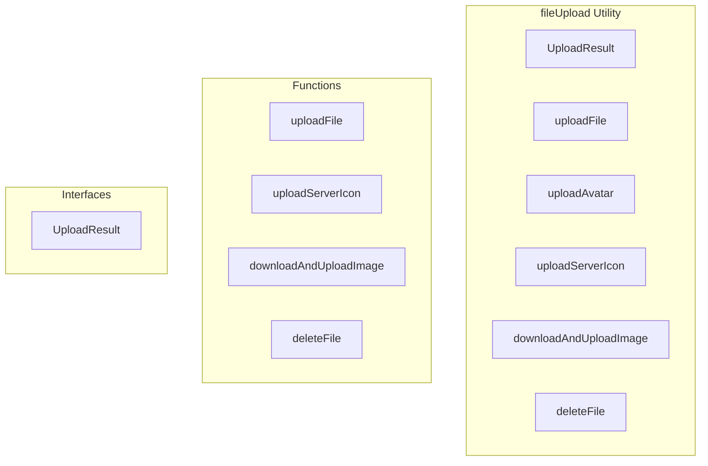

# fileUpload Utility

**File:** `src/utils/fileUpload.ts`

## Overview




## Exports

- **UploadResult** - interface export
- **uploadFile** - function export
- **uploadAvatar** - function export
- **uploadServerIcon** - function export
- **downloadAndUploadImage** - function export
- **deleteFile** - function export

## Functions

### `uploadFile(file: File, bucket: string, path: string)`

No description available.

**Parameters:**
- `file: File`
- `bucket: string`
- `path: string`

**Returns:** `Promise&lt;UploadResult&gt;`

```typescript
/**
 * Upload a file to Supabase storage
 * @param file The file to upload
 * @param bucket The storage bucket name
 * @param path The file path in the bucket
 * @returns Promise<UploadResult>
 */
export async function uploadFile(
  file: File,
  bucket: string,
  path: string
): Promise<UploadResult>
```

### `uploadServerIcon(file: File, serverId: string)`

No description available.

**Parameters:**
- `file: File`
- `serverId: string`

**Returns:** `Promise&lt;UploadResult&gt;`

```typescript
/**
 * Upload user avatar
 * @param file The avatar file
 * @param userId The user ID
 * @returns Promise<UploadResult>
 */
// TODO: profileService.ts should handle avatar uploads, not this file
export async function uploadAvatar(file: File, userId: string): Promise<UploadResult> {
  // const fileExt = file.name.split('.').pop() || 'jpg';
  // Let Supabase auto-generate the UUID, just provide the folder structure
  const filePath = `${userId}/${file.name}`;

  const processedFile: UploadResult = await uploadFile(file, 'avatars', filePath);
  if (!processedFile.success) {
    processedFile.path = filePath; // Include path even if upload failed
  }
  return processedFile;
}

/**
 * Upload server icon
 * @param file The icon file
 * @param serverId The server ID
 * @returns Promise<UploadResult>
 */
export async function uploadServerIcon(file: File, serverId: string): Promise<UploadResult>
```

### `downloadAndUploadImage(imageUrl: string, userId: string, type: 'avatar' | 'banner' = 'avatar')`

No description available.

**Parameters:**
- `imageUrl: string`
- `userId: string`
- `type: 'avatar' | 'banner' = 'avatar'`

**Returns:** `Promise&lt;UploadResult&gt;`

```typescript
/**
 * Download an image from a URL and upload it to Supabase storage
 * @param imageUrl The URL of the image to download
 * @param userId The user ID
 * @param type 'avatar' or 'banner'
 * @returns Promise<UploadResult>
 */
export async function downloadAndUploadImage(
  imageUrl: string,
  userId: string,
  type: 'avatar' | 'banner' = 'avatar'
): Promise<UploadResult>
```

### `deleteFile(bucket: string, path: string)`

No description available.

**Parameters:**
- `bucket: string`
- `path: string`

**Returns:** `Promise&lt;boolean&gt;`

```typescript
/**
 * Delete a file from storage
 * @param bucket The storage bucket name
 * @param path The file path
 * @returns Promise<boolean>
 */
export async function deleteFile(bucket: string, path: string): Promise<boolean>
```


## Interfaces

### UploadResult

No description available.

```typescript
interface UploadResult {

  success: boolean;
  url?: string;
  path?: string;
  error?: string;

}
```


## Source Code Insights

**File Size:** 5500 characters
**Lines of Code:** 199
**Imports:** 2

## Usage Example

```typescript
import { UploadResult, uploadFile, uploadAvatar, uploadServerIcon, downloadAndUploadImage, deleteFile } from '@/utils/fileUpload'

// Example usage
uploadFile()
```

---

*This documentation was automatically generated from the source code.*