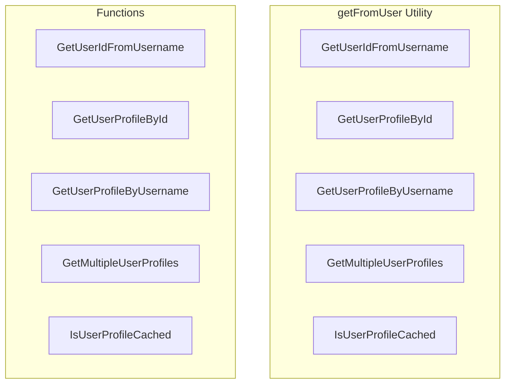

# getFromUser Utility

**File:** `src/utils/getFromUser.ts`

## Overview




## Exports

- **GetUserIdFromUsername** - const export
- **GetUserProfileById** - const export
- **GetUserProfileByUsername** - const export
- **GetMultipleUserProfiles** - const export
- **IsUserProfileCached** - const export

## Functions

### `GetUserIdFromUsername(username: string)`

No description available.

**Parameters:**
- `username: string`

**Returns:** `Promise&lt;string&gt;`

```typescript
export const GetUserIdFromUsername = async (username: string): Promise<string> =>
```

### `GetUserProfileById(userId: string, forceRefresh = false)`

No description available.

**Parameters:**
- `userId: string`
- `forceRefresh = false`

**Returns:** `Promise&lt;User | null&gt;`

```typescript
export const GetUserProfileById = async (userId: string, forceRefresh = false): Promise<User | null> =>
```

### `GetUserProfileByUsername(username: string, forceRefresh = false)`

No description available.

**Parameters:**
- `username: string`
- `forceRefresh = false`

**Returns:** `Promise&lt;User | null&gt;`

```typescript
export const GetUserProfileByUsername = async (username: string, forceRefresh = false): Promise<User | null> =>
```

### `GetMultipleUserProfiles(userIds: string[], forceRefresh = false)`

No description available.

**Parameters:**
- `userIds: string[]`
- `forceRefresh = false`

**Returns:** `Promise&lt;Record&lt;string, User&gt;&gt;`

```typescript
export const GetMultipleUserProfiles = async (userIds: string[], forceRefresh = false): Promise<Record<string, User>> =>
```

### `IsUserProfileCached(userId: string)`

No description available.

**Parameters:**
- `userId: string`

**Returns:** `boolean`

```typescript
export const IsUserProfileCached = (userId: string): boolean =>
```


## Source Code Insights

**File Size:** 1817 characters
**Lines of Code:** 46
**Imports:** 4

## Usage Example

```typescript
import { GetUserIdFromUsername, GetUserProfileById, GetUserProfileByUsername, GetMultipleUserProfiles, IsUserProfileCached } from '@/utils/getFromUser'

// Example usage
GetUserIdFromUsername()
```

---

*This documentation was automatically generated from the source code.*