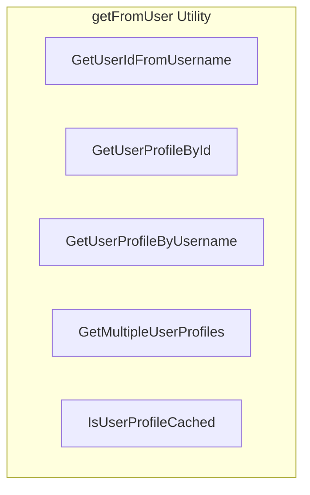

# getFromUser Utility

**File:** `src/utils/getFromUser.ts`

## Overview


```mermaid
graph TB
    subgraph "getFromUser Utility"
        GETUSERIDFROMUSERNAME[GetUserIdFromUsername]
        GETUSERPROFILEBYID[GetUserProfileById]
        GETUSERPROFILEBYUSERNAME[GetUserProfileByUsername]
        GETMULTIPLEUSERPROFILES[GetMultipleUserProfiles]
        ISUSERPROFILECACHED[IsUserProfileCached]
    end
    
    
    
    
```

## Exports

- **GetUserIdFromUsername** - No description
- **GetUserProfileById** - No description
- **GetUserProfileByUsername** - No description
- **GetMultipleUserProfiles** - No description
- **IsUserProfileCached** - No description


## Source Code Insights

**File Size:** 1783 characters
**Lines of Code:** 45
**Imports:** 3

## Usage Example

```typescript
import { GetUserIdFromUsername, GetUserProfileById, GetUserProfileByUsername, GetMultipleUserProfiles, IsUserProfileCached } from '@/utils/getFromUser.ts'

// Example usage
// Use the exported functionality
```

---

*This documentation was automatically generated from the source code.*