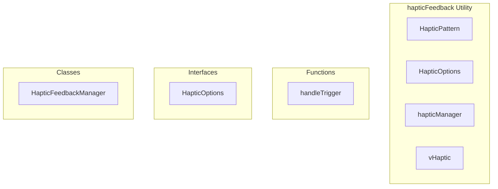

# hapticFeedback Utility

**File:** `src/utils/hapticFeedback.ts`

## Overview




## Exports

- **HapticPattern** - type export
- **HapticOptions** - interface export
- **hapticManager** - const export
- **vHaptic** - const export

## Functions

### `handleTrigger()`

No description available.

**Parameters:**
None

**Returns:** `Unknown`

```typescript
const handleTrigger = () =>
```


## Classes

### HapticFeedbackManager

No description available.

**Methods:**
- `constructor`
- `detectSupport`
- `loadPreferences`
- `getPatternDuration`
- `trigger`
- `catch`
- `light`
- `medium`
- `heavy`
- `success`
- `warning`
- `error`
- `selection`
- `impact`
- `notification`
- `setEnabled`
- `enabled`
- `supported`

**Properties:**
- `isEnabled`
- `isSupported`
- `APIs`
- `feedback`
- `Note`
- `stored`
- `true`
- `patterns`
- `light`
- `medium`
- `heavy`
- `success`
- `warning`
- `error`
- `selection`
- `impact`
- `notification`
- `20`
- `HapticOptions`
- `pattern`
- `available`
- `vibrationPattern`
- `browsers`
- `failed`
- `enabled`
- `supported`


## Interfaces

### HapticOptions

No description available.

```typescript
interface HapticOptions {

  pattern?: HapticPattern
  duration?: number
  intensity?: number
  enabled?: boolean

}
```


## Type Definitions

### HapticPattern

No description available.

```typescript
/**
 * Haptic Feedback Utility for Native App Feel
 * Provides tactile feedback on supported devices
 */

export type HapticPattern = 'light' | 'medium' | 'heavy' | 'success' | 'warning' | 'error' | 'selection' | 'impact' | 'notification'

export interface HapticOptions {
  pattern?: HapticPattern
  duration?: number
  intensity?: number
  enabled?: boolean
}

class HapticFeedbackManager {
  private isEnabled: boolean = true
  private isSupported: boolean = false

  constructor() {
    this.dete...
```


## Source Code Insights

**File Size:** 4584 characters
**Lines of Code:** 182
**Imports:** 0

## Usage Example

```typescript
import { HapticPattern, HapticOptions, hapticManager, vHaptic } from '@/utils/hapticFeedback'

// Example usage
handleTrigger()
```

---

*This documentation was automatically generated from the source code.*