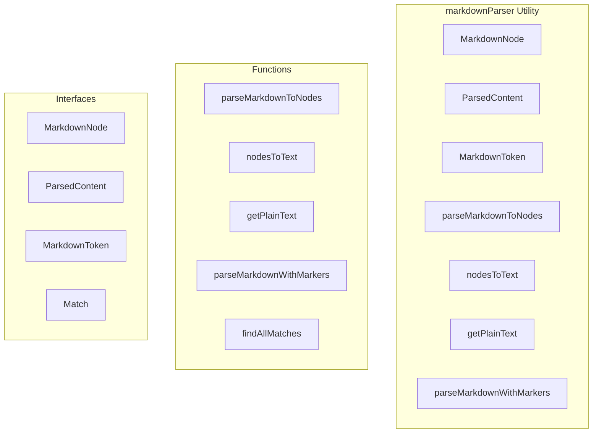

# markdownParser Utility

**File:** `src/utils/markdownParser.ts`

## Overview




## Exports

- **MarkdownNode** - interface export
- **ParsedContent** - interface export
- **MarkdownToken** - interface export
- **parseMarkdownToNodes** - function export
- **nodesToText** - function export
- **getPlainText** - function export
- **parseMarkdownWithMarkers** - function export

## Functions

### `parseMarkdownToNodes(text: string)`

No description available.

**Parameters:**
- `text: string`

**Returns:** `MarkdownNode[]`

```typescript
export function parseMarkdownToNodes(text: string): MarkdownNode[]
```

### `nodesToText(nodes: MarkdownNode[])`

No description available.

**Parameters:**
- `nodes: MarkdownNode[]`

**Returns:** `string`

```typescript
export function nodesToText(nodes: MarkdownNode[]): string
```

### `getPlainText(nodes: MarkdownNode[])`

No description available.

**Parameters:**
- `nodes: MarkdownNode[]`

**Returns:** `string`

```typescript
export function getPlainText(nodes: MarkdownNode[]): string
```

### `parseMarkdownWithMarkers(text: string)`

No description available.

**Parameters:**
- `text: string`

**Returns:** `MarkdownToken[]`

```typescript
export function parseMarkdownWithMarkers(text: string): MarkdownToken[]
```

### `findAllMatches(text: string)`

No description available.

**Parameters:**
- `text: string`

**Returns:** `Match[]`

```typescript
const findAllMatches = (text: string): Match[] =>
```


## Interfaces

### MarkdownNode

No description available.

```typescript
interface MarkdownNode {

  type: 'text' | 'bold' | 'italic' | 'underline' | 'strikethrough' | 'code' | 'codeblock' | 'emoji' | 'newline';
  content: string;
  language?: string; // For code blocks
  emojiData?: { name: string; url: string; id: string };
  children?: MarkdownNode[];

}
```

### ParsedContent

No description available.

```typescript
interface ParsedContent {

  text: string;
  nodes: MarkdownNode[];

}
```

### MarkdownToken

No description available.

```typescript
interface MarkdownToken {

  type: 'text' | 'bold' | 'italic' | 'underline' | 'strikethrough' | 'code' | 'codeblock' | 'emoji';
  content: string;
  language?: string; // For code blocks
  raw?: string; // The original text including markers

}
```

### Match

No description available.

```typescript
interface Match {

    type: keyof typeof PATTERNS;
    match: RegExpMatchArray;
    start: number;
    end: number;
    content: string;
    language?: string;
  
}
```


## Constants

### PATTERNS

No description available.

```typescript
const PATTERNS = {
```


## Source Code Insights

**File Size:** 10786 characters
**Lines of Code:** 384
**Imports:** 0

## Usage Example

```typescript
import { MarkdownNode, ParsedContent, MarkdownToken, parseMarkdownToNodes, nodesToText, getPlainText, parseMarkdownWithMarkers } from '@/utils/markdownParser'

// Example usage
parseMarkdownToNodes()
```

---

*This documentation was automatically generated from the source code.*