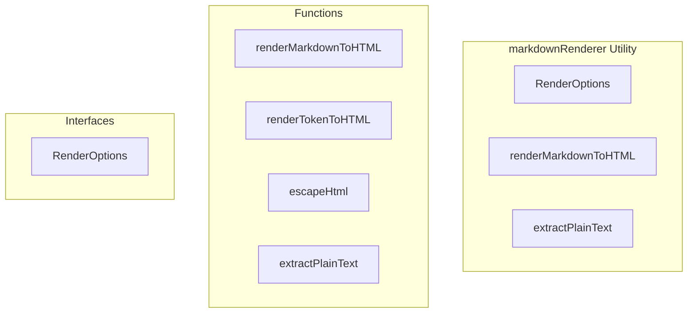

# markdownRenderer Utility

**File:** `src/utils/markdownRenderer.ts`

## Overview




## Exports

- **RenderOptions** - interface export
- **renderMarkdownToHTML** - function export
- **extractPlainText** - function export

## Functions

### `renderMarkdownToHTML(text: string, options: RenderOptions = {})`

No description available.

**Parameters:**
- `text: string`
- `options: RenderOptions = {}`

**Returns:** `string`

```typescript
export function renderMarkdownToHTML(text: string, options: RenderOptions = {}): string
```

### `renderTokenToHTML(token: MarkdownToken, options: RenderOptions)`

No description available.

**Parameters:**
- `token: MarkdownToken`
- `options: RenderOptions`

**Returns:** `string`

```typescript
function renderTokenToHTML(token: MarkdownToken, options: RenderOptions): string
```

### `escapeHtml(text: string)`

No description available.

**Parameters:**
- `text: string`

**Returns:** `string`

```typescript
function escapeHtml(text: string): string
```

### `extractPlainText(text: string)`

No description available.

**Parameters:**
- `text: string`

**Returns:** `string`

```typescript
export function extractPlainText(text: string): string
```


## Interfaces

### RenderOptions

No description available.

```typescript
interface RenderOptions {

  showMarkers?: boolean; // Whether to show markdown markers
  singleLine?: boolean; // Render as single line (for previews)
  allowImages?: boolean; // Whether to render images
  allowVideos?: boolean; // Whether to render videos
  emojiResolver?: (name: string) => { url: string; id: string } | null;

}
```


## Source Code Insights

**File Size:** 5459 characters
**Lines of Code:** 153
**Imports:** 2

## Usage Example

```typescript
import { RenderOptions, renderMarkdownToHTML, extractPlainText } from '@/utils/markdownRenderer'

// Example usage
renderMarkdownToHTML()
```

---

*This documentation was automatically generated from the source code.*