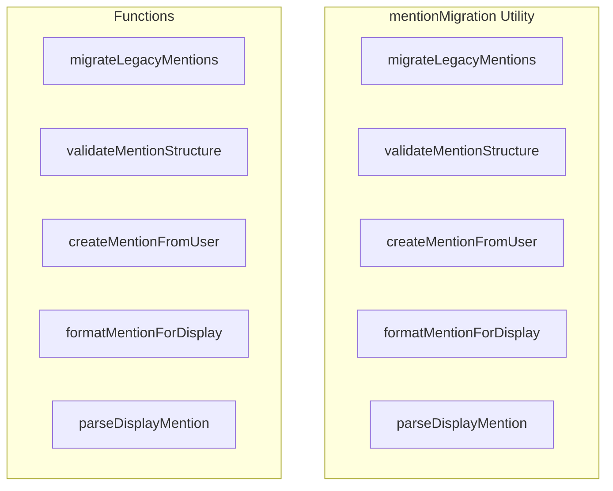

# mentionMigration Utility

**File:** `src/utils/mentionMigration.ts`

## Overview




## Exports

- **migrateLegacyMentions** - function export
- **validateMentionStructure** - function export
- **createMentionFromUser** - function export
- **formatMentionForDisplay** - function export
- **parseDisplayMention** - function export

## Functions

### `migrateLegacyMentions(content: MessagePart[])`

No description available.

**Parameters:**
- `content: MessagePart[]`

**Returns:** `MessagePart[]`

```typescript
/**
 * Utility functions for migrating and validating mention data structures
 */

/**
 * Migrates legacy mention format to new structured format
 * @param content MessagePart array that might contain legacy mentions
 * @returns Updated MessagePart array with structured mentions
 */
export function migrateLegacyMentions(content: MessagePart[]): MessagePart[]
```

### `validateMentionStructure(mention: MentionContent)`

No description available.

**Parameters:**
- `mention: MentionContent`

**Returns:** `boolean`

```typescript
/**
 * Validates that a mention object has all required fields
 * @param mention MentionContent object to validate
 * @returns boolean indicating if the mention is valid
 */
export function validateMentionStructure(mention: MentionContent): boolean
```

### `createMentionFromUser(userId: string, userProfile?: any)`

No description available.

**Parameters:**
- `userId: string`
- `userProfile?: any`

**Returns:** `MentionContent | null`

```typescript
/**
 * Creates a properly structured mention object from user data
 * @param userId User ID
 * @param userProfile User profile data (optional, will be fetched if not provided)
 * @returns MentionContent object or null if user not found
 */
export function createMentionFromUser(userId: string, userProfile?: any): MentionContent | null
```

### `formatMentionForDisplay(mention: MentionContent)`

No description available.

**Parameters:**
- `mention: MentionContent`

**Returns:** `string`

```typescript
/**
 * Formats mention for display based on local/remote status
 * @param mention MentionContent object
 * @returns Display string (@username or @username@domain)
 */
export function formatMentionForDisplay(mention: MentionContent): string
```

### `parseDisplayMention(displayMention: string)`

No description available.

**Parameters:**
- `displayMention: string`

**Returns:** `MentionContent | null`

```typescript
/**
 * Converts display format mention (@username or @username@domain) to structured mention
 * @param displayMention Display format mention string
 * @returns MentionContent object or null if user not found
 */
export function parseDisplayMention(displayMention: string): MentionContent | null
```


## Source Code Insights

**File Size:** 3752 characters
**Lines of Code:** 121
**Imports:** 2

## Usage Example

```typescript
import { migrateLegacyMentions, validateMentionStructure, createMentionFromUser, formatMentionForDisplay, parseDisplayMention } from '@/utils/mentionMigration'

// Example usage
migrateLegacyMentions()
```

---

*This documentation was automatically generated from the source code.*