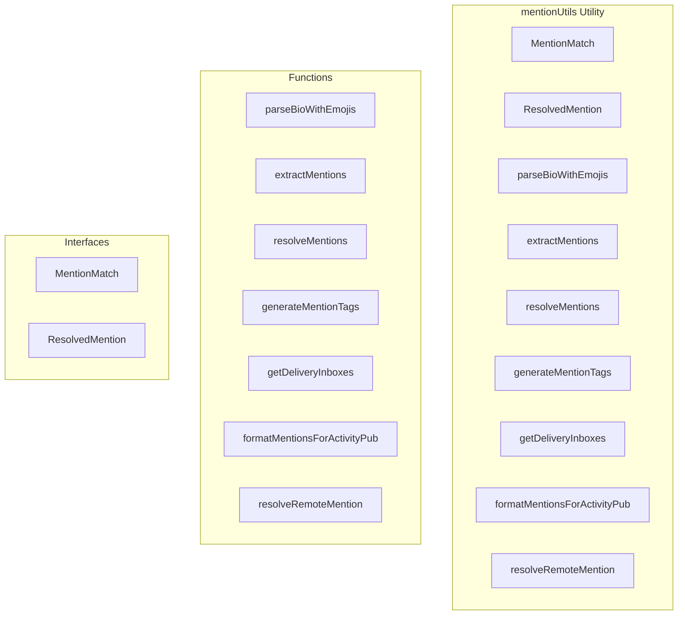

# mentionUtils Utility

**File:** `src/utils/mentionUtils.ts`

## Overview




## Exports

- **MentionMatch** - interface export
- **ResolvedMention** - interface export
- **parseBioWithEmojis** - function export
- **extractMentions** - function export
- **resolveMentions** - function export
- **generateMentionTags** - function export
- **getDeliveryInboxes** - function export
- **formatMentionsForActivityPub** - function export
- **resolveRemoteMention** - function export

## Functions

### `parseBioWithEmojis(bio: string, emojis: Array&lt;{name: string, url: string}&gt;)`

No description available.

**Parameters:**
- `bio: string`
- `emojis: Array&lt;{name: string, url: string}&gt;`

**Returns:** `any[]`

```typescript
/**
 * Professional mention extraction and processing utilities
 * Handles both local (@username) and remote (@username@domain) mentions
 */

import { supabase } from '@/supabase';
import type { UserData } from '@/types';
import { debug } from '@/utils/debug'

export interface MentionMatch {
  full: string;          // "@tester004@mastodon.social"
  username: string;      // "tester004"
  domain?: string;       // "mastodon.social" or undefined for local
  startIndex: number;
  endIndex: number;
}

export interface ResolvedMention {
  mention: MentionMatch;
  user?: UserData;
  inboxUrl?: string;
  actorUrl?: string;
}

/**
 * Parse bio text with custom emojis and convert to MessagePart[]
 * Replaces :emoji: patterns with proper emoji parts
 */
export function parseBioWithEmojis(bio: string, emojis: Array<{name: string, url: string}>): any[]
```

### `extractMentions(text: string)`

No description available.

**Parameters:**
- `text: string`

**Returns:** `MentionMatch[]`

```typescript
/**
 * Extract all mentions from text content
 * Supports both @username (local) and @username@domain (remote) formats
 */
export function extractMentions(text: string): MentionMatch[]
```

### `resolveMentions(mentions: MentionMatch[])`

No description available.

**Parameters:**
- `mentions: MentionMatch[]`

**Returns:** `Promise&lt;ResolvedMention[]&gt;`

```typescript
/**
 * Resolve mentions to actual users and their federation details
 */
export async function resolveMentions(mentions: MentionMatch[]): Promise<ResolvedMention[]>
```

### `generateMentionTags(resolvedMentions: ResolvedMention[])`

No description available.

**Parameters:**
- `resolvedMentions: ResolvedMention[]`

**Returns:** `any[]`

```typescript
/**
 * Generate ActivityPub-compatible mention tags for activities
 */
export function generateMentionTags(resolvedMentions: ResolvedMention[]): any[]
```

### `getDeliveryInboxes(resolvedMentions: ResolvedMention[])`

No description available.

**Parameters:**
- `resolvedMentions: ResolvedMention[]`

**Returns:** `string[]`

```typescript
/**
 * Get unique inbox URLs from resolved mentions for federation delivery
 */
export function getDeliveryInboxes(resolvedMentions: ResolvedMention[]): string[]
```

### `formatMentionsForActivityPub(text: string, resolvedMentions: ResolvedMention[])`

No description available.

**Parameters:**
- `text: string`
- `resolvedMentions: ResolvedMention[]`

**Returns:** `string`

```typescript
/**
 * Convert plain text with mentions to ActivityPub HTML format
 */
export function formatMentionsForActivityPub(
  text: string, 
  resolvedMentions: ResolvedMention[]
): string
```

### `resolveRemoteMention(username: string, domain: string, forceRefresh: boolean = false)`

No description available.

**Parameters:**
- `username: string`
- `domain: string`
- `forceRefresh: boolean = false`

**Returns:** `Promise&lt;FederatedUser | null&gt;`

```typescript
/**
 * Attempt to resolve remote mention via backend WebFinger proxy
 * Uses the federation backend to bypass CORS restrictions
 */
export async function resolveRemoteMention(username: string, domain: string, forceRefresh: boolean = false): Promise<FederatedUser | null>
```


## Interfaces

### MentionMatch

No description available.

```typescript
interface MentionMatch {

  full: string;          // "@tester004@mastodon.social"
  username: string;      // "tester004"
  domain?: string;       // "mastodon.social" or undefined for local
  startIndex: number;
  endIndex: number;

}
```

### ResolvedMention

No description available.

```typescript
interface ResolvedMention {

  mention: MentionMatch;
  user?: UserData;
  inboxUrl?: string;
  actorUrl?: string;

}
```


## Source Code Insights

**File Size:** 10628 characters
**Lines of Code:** 348
**Imports:** 3

## Usage Example

```typescript
import { MentionMatch, ResolvedMention, parseBioWithEmojis, extractMentions, resolveMentions, generateMentionTags, getDeliveryInboxes, formatMentionsForActivityPub, resolveRemoteMention } from '@/utils/mentionUtils'

// Example usage
parseBioWithEmojis()
```

---

*This documentation was automatically generated from the source code.*