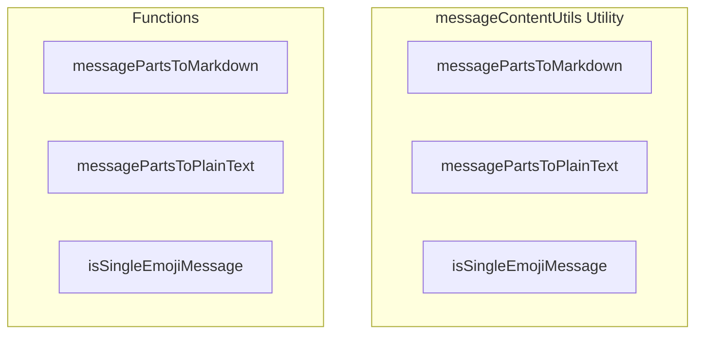

# messageContentUtils Utility

**File:** `src/utils/messageContentUtils.ts`

## Overview




## Exports

- **messagePartsToMarkdown** - function export
- **messagePartsToPlainText** - function export
- **isSingleEmojiMessage** - function export

## Functions

### `messagePartsToMarkdown(parts: MessagePart[])`

No description available.

**Parameters:**
- `parts: MessagePart[]`

**Returns:** `string`

```typescript
/**
 * Convert MessagePart[] to markdown text for rendering with MarkdownContent
 */
export function messagePartsToMarkdown(parts: MessagePart[]): string
```

### `messagePartsToPlainText(parts: MessagePart[])`

No description available.

**Parameters:**
- `parts: MessagePart[]`

**Returns:** `string`

```typescript
/**
 * Extract plain text from MessagePart[] for previews
 */
export function messagePartsToPlainText(parts: MessagePart[]): string
```

### `isSingleEmojiMessage(parts: MessagePart[])`

No description available.

**Parameters:**
- `parts: MessagePart[]`

**Returns:** `boolean`

```typescript
/**
 * Check if message content contains only a single emoji
 */
export function isSingleEmojiMessage(parts: MessagePart[]): boolean
```


## Source Code Insights

**File Size:** 2529 characters
**Lines of Code:** 106
**Imports:** 1

## Usage Example

```typescript
import { messagePartsToMarkdown, messagePartsToPlainText, isSingleEmojiMessage } from '@/utils/messageContentUtils'

// Example usage
messagePartsToMarkdown()
```

---

*This documentation was automatically generated from the source code.*