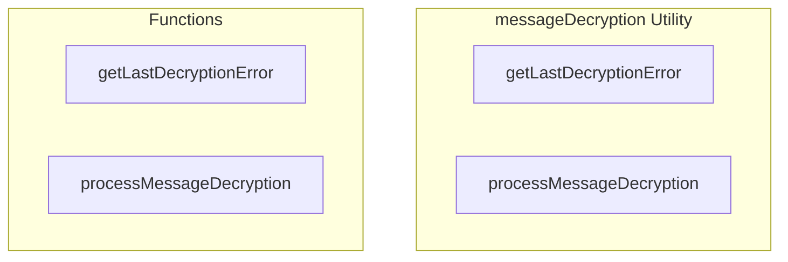

# messageDecryption Utility

**File:** `src/utils/messageDecryption.ts`

## Overview




## Exports

- **getLastDecryptionError** - function export
- **processMessageDecryption** - function export

## Functions

### `getLastDecryptionError()`

No description available.

**Parameters:**
None

**Returns:** `string | null`

```typescript
/**
 * Message Decryption Middleware
 * 
 * Decrypts encrypted messages using Megolm-style room-based encryption.
 * Each channel/conversation has a session key shared with all members.
 * Keys are backed up to server (encrypted with user's recovery key).
 */

import type { Message, MessagePart } from '@/types'
import { supabase } from '@/supabase'
import { debug } from '@/utils/debug'

// Track decryption failures for debugging
let lastDecryptionError: string | null = null

/**
 * Get the last decryption error (for debugging/UI display)
 */
export function getLastDecryptionError(): string | null
```

### `processMessageDecryption(messages: Message[])`

No description available.

**Parameters:**
- `messages: Message[]`

**Returns:** `Promise&lt;Message[]&gt;`

```typescript
/**
 * Process messages and attempt to decrypt encrypted ones
 */
export async function processMessageDecryption(messages: Message[]): Promise<Message[]>
```


## Source Code Insights

**File Size:** 5040 characters
**Lines of Code:** 137
**Imports:** 3

## Usage Example

```typescript
import { getLastDecryptionError, processMessageDecryption } from '@/utils/messageDecryption'

// Example usage
getLastDecryptionError()
```

---

*This documentation was automatically generated from the source code.*