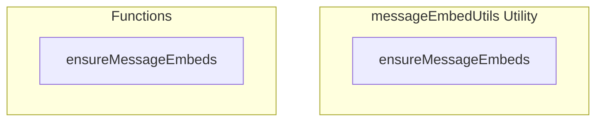

# messageEmbedUtils Utility

**File:** `src/utils/messageEmbedUtils.ts`

## Overview




## Exports

- **ensureMessageEmbeds** - function export

## Functions

### `ensureMessageEmbeds(target: Message | Message[])`

No description available.

**Parameters:**
- `target: Message | Message[]`

**Returns:** `void`

```typescript
export function ensureMessageEmbeds(target: Message | Message[]): void
```


## Source Code Insights

**File Size:** 876 characters
**Lines of Code:** 34
**Imports:** 2

## Usage Example

```typescript
import { ensureMessageEmbeds } from '@/utils/messageEmbedUtils'

// Example usage
ensureMessageEmbeds()
```

---

*This documentation was automatically generated from the source code.*