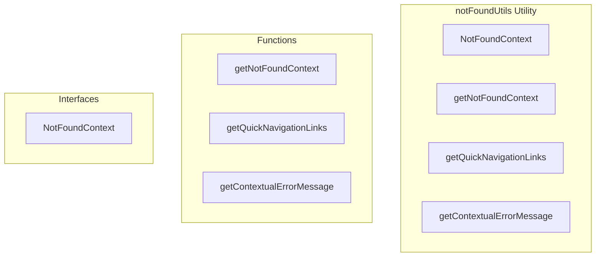

# notFoundUtils Utility

**File:** `src/utils/notFoundUtils.ts`

## Overview




## Exports

- **NotFoundContext** - interface export
- **getNotFoundContext** - function export
- **getQuickNavigationLinks** - function export
- **getContextualErrorMessage** - function export

## Functions

### `getNotFoundContext(currentRoute: RouteLocationNormalized, previousRoute?: RouteLocationNormalized)`

No description available.

**Parameters:**
- `currentRoute: RouteLocationNormalized`
- `previousRoute?: RouteLocationNormalized`

**Returns:** `NotFoundContext`

```typescript
/**
 * Layout-aware 404 utilities
 * Provides smart routing and layout detection for 404 pages
 */

import type { RouteLocationNormalized } from 'vue-router'
import { useAuthStore } from '@/stores/auth'

export interface NotFoundContext {
  isAuthenticated: boolean
  suggestedRoute: string
  layoutType: 'auth' | 'base' | 'social' | 'chat'
  previousRoute?: RouteLocationNormalized
}

/**
 * Determines the appropriate 404 handling based on user state and route context
 */
export function getNotFoundContext(
  currentRoute: RouteLocationNormalized,
  previousRoute?: RouteLocationNormalized
): NotFoundContext
```

### `getQuickNavigationLinks(context: NotFoundContext)`

No description available.

**Parameters:**
- `context: NotFoundContext`

**Returns:** `void`

```typescript
/**
 * Gets appropriate quick navigation links based on context
 */
export function getQuickNavigationLinks(context: NotFoundContext)
```

### `getContextualErrorMessage(route: RouteLocationNormalized)`

No description available.

**Parameters:**
- `route: RouteLocationNormalized`

**Returns:** `void`

```typescript
/**
 * Get user-friendly error messages based on the attempted route
 */
export function getContextualErrorMessage(route: RouteLocationNormalized):
```


## Interfaces

### NotFoundContext

No description available.

```typescript
interface NotFoundContext {

  isAuthenticated: boolean
  suggestedRoute: string
  layoutType: 'auth' | 'base' | 'social' | 'chat'
  previousRoute?: RouteLocationNormalized

}
```


## Source Code Insights

**File Size:** 4412 characters
**Lines of Code:** 141
**Imports:** 2

## Usage Example

```typescript
import { NotFoundContext, getNotFoundContext, getQuickNavigationLinks, getContextualErrorMessage } from '@/utils/notFoundUtils'

// Example usage
getNotFoundContext()
```

---

*This documentation was automatically generated from the source code.*